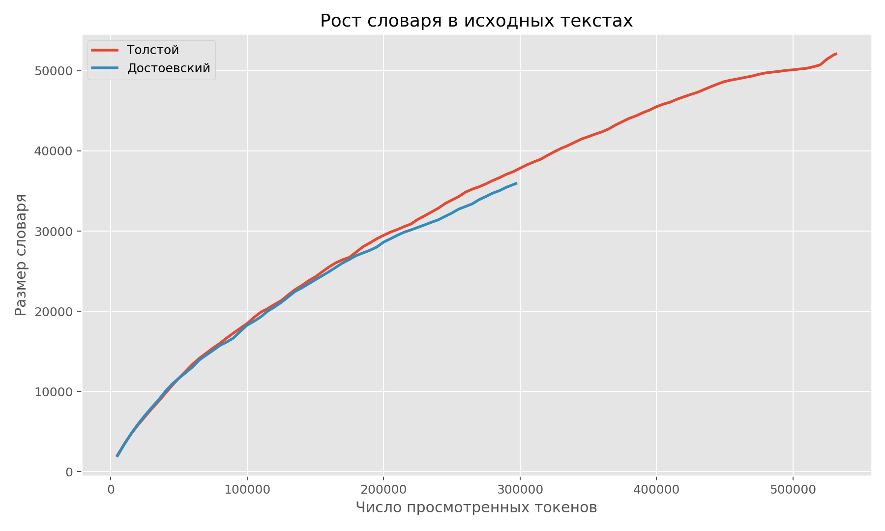
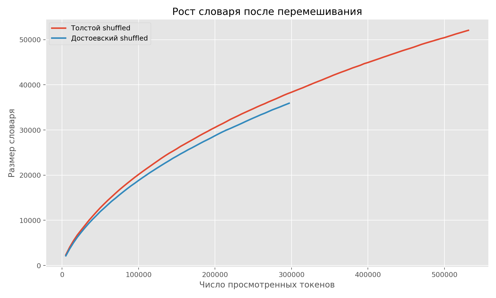
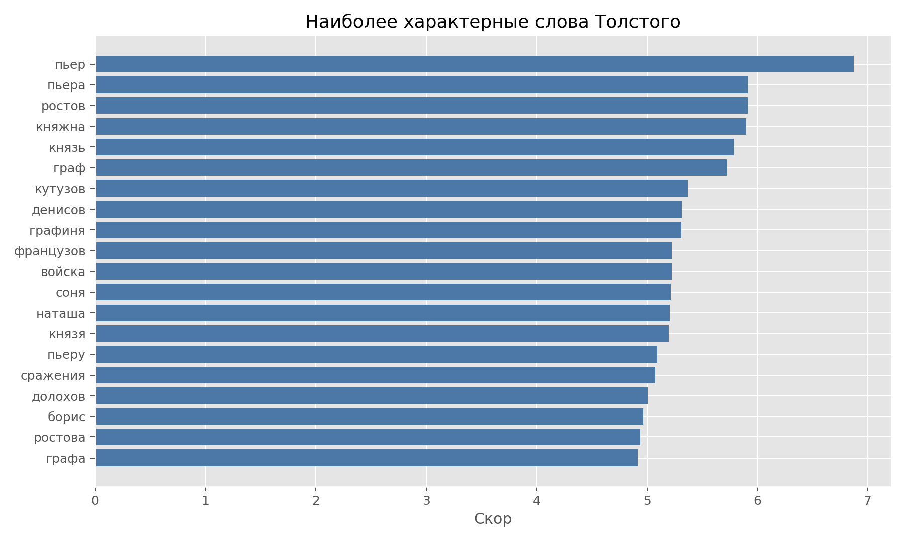
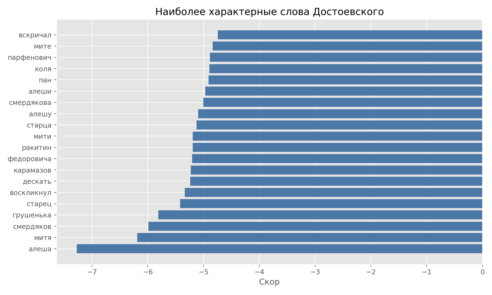

# Отчет по дополнительной задаче: Толстой и Достоевский

## 1. Постановка задачи

В этой задаче нужно сравнить словарное поведение двух авторов на материале `Войны и мира` Льва Толстого и `Братьев Карамазовых` Федора Достоевского. Нас интересуют три вещи: рост словаря в исходных текстах, влияние случайного перемешивания токенов и наиболее характерные слова каждого автора.

Важно, что анализ проводится не по всему творчеству авторов, а по выбранным романам. Поэтому результаты ниже отражают одновременно и авторскую манеру, и лексику конкретных произведений.

## 2. Базовые статистики

| Автор       | Токены   | Уникальные слова   |   Type-token ratio |   Средняя длина токена |
|:------------|:---------|:-------------------|-------------------:|-----------------------:|
| Толстой     | 531 443  | 52 075             |              0.098 |                 5.0647 |
| Достоевский | 297 011  | 35 929             |              0.121 |                 4.7825 |

В абсолютном размере словарь Толстого больше, но относительная лексическая насыщенность по `type-token ratio` выше у Достоевского.

## 3. Рост словаря в исходных текстах

На исходных текстах кривые растут неравномерно: это означает, что новые слова приходят не случайным равномерным потоком, а блоками, связанными со сценами, персонажами и тематическими переходами.

## 4. Рост словаря после перемешивания

После случайного перемешивания токенов рост словаря становится более гладким. На отметке около `100 000` токенов shuffled-версия дает словарь больше на `1663` слова у Толстого и на `547` слов у Достоевского. Максимальный разрыв между shuffled и исходной кривой достигает `1819` и `937` слов соответственно.

## 5. Наиболее характерные слова авторов

| Слово     |   Скор |   Частота у Толстого |   Частота у Достоевского |
|:----------|-------:|---------------------:|-------------------------:|
| пьер      | 6.8691 |                 1574 |                        0 |
| пьера     | 5.9123 |                  604 |                        0 |
| ростов    | 5.909  |                  602 |                        0 |
| княжна    | 5.8973 |                  595 |                        0 |
| князь     | 5.7819 |                 1592 |                        2 |
| граф      | 5.7177 |                  497 |                        0 |
| кутузов   | 5.3707 |                  351 |                        0 |
| денисов   | 5.3152 |                  332 |                        0 |
| графиня   | 5.3092 |                  330 |                        0 |
| французов | 5.2241 |                  303 |                        0 |

| Слово      |    Скор |   Частота у Толстого |   Частота у Достоевского |
|:-----------|--------:|---------------------:|-------------------------:|
| алеша      | -7.2717 |                    0 |                      878 |
| митя       | -6.19   |                    1 |                      595 |
| смердяков  | -5.986  |                    0 |                      242 |
| грушенька  | -5.811  |                    0 |                      203 |
| старец     | -5.4202 |                    0 |                      137 |
| воскликнул | -5.3371 |                    0 |                      126 |
| дескать    | -5.2378 |                    0 |                      114 |
| карамазов  | -5.2291 |                    0 |                      113 |
| федоровича | -5.2024 |                    0 |                      110 |
| мити       | -5.1934 |                    0 |                      109 |

После очистки технического шума у Толстого особенно выделяются слова `пьер`, `пьера`, `ростов`, `княжна`, `князь`, `граф`, `кутузов`, а у Достоевского — `алеша`, `митя`, `смердяков`, `грушенька`, `старец`, `карамазов`, `ракитин`.

## 6. Сравнение словарей после лемматизации

Дополнительно провел анализ на уровне лемм. Чтобы посмотреть, насколько сильно морфология раздувает исходный словарь.

| Автор       | Токены   | Уникальные словоформы   | Уникальные леммы   | Сокращение словаря   |   Сокращение, % |
|:------------|:---------|:------------------------|:-------------------|:---------------------|----------------:|
| Толстой     | 531 443  | 52 075                  | 18 634             | 33 441               |           64.22 |
| Достоевский | 297 011  | 35 929                  | 14 426             | 21 503               |           59.85 |

После лемматизации словарь Толстого сокращается сильнее в абсолютном выражении, потому что у него изначально больше словоформ. При этом у обоих авторов заметная часть различий между словоформами схлопывается в общие леммы.

### Наиболее характерные леммы Толстого

| Лемма    |   Скор |   Частота у Толстого |   Частота у Достоевского |
|:---------|-------:|---------------------:|-------------------------:|
| пьер     | 7.2899 |                 2534 |                        0 |
| княжна   | 6.3756 |                 1015 |                        0 |
| ростов   | 6.3272 |                  967 |                        0 |
| граф     | 6.0931 |                  765 |                        0 |
| войско   | 5.9118 |                  638 |                        0 |
| денисов  | 5.7799 |                  559 |                        0 |
| сражение | 5.7799 |                  559 |                        0 |
| графиня  | 5.7472 |                  541 |                        0 |
| соня     | 5.7153 |                  524 |                        0 |
| князь    | 5.6733 |                 2516 |                        4 |

### Наиболее характерные леммы Достоевского

| Лемма     |    Скор |   Частота у Толстого |   Частота у Достоевского |
|:----------|--------:|---------------------:|-------------------------:|
| алеш      | -6.9425 |                    1 |                     1196 |
| митя      | -6.6223 |                    1 |                      868 |
| смердяков | -6.4987 |                    0 |                      383 |
| грушенек  | -6.0893 |                    0 |                      254 |
| карамазов | -5.7466 |                    0 |                      180 |
| пан       | -5.6107 |                    0 |                      157 |
| ракитин   | -5.585  |                    0 |                      153 |
| старец    | -5.562  |                    1 |                      300 |
| дескать   | -5.293  |                    0 |                      114 |
| илюша     | -5.2755 |                    0 |                      112 |

После лемматизации видно, что формы типа `пьер` и `пьера` или `алеша` и `алеши` схлопываются, поэтому сравнение становится немного ближе к тематическому и понятийному уровню, а не к чистой словоформенной поверхности текста.

При этом автоматическая лемматизация художественного текста и имен собственных неидеальна: для некоторых форм появляются артефакты вроде `алеш` или `грушенек`. Поэтому лемматизированный анализ здесь полезен именно как дополнительное сравнение словаря, а не как абсолютно точное представление авторской лексики.

## 7. Итоговые выводы

- Словарь Толстого в выбранных текстах больше в абсолютном размере, но у Достоевского выше относительная лексическая насыщенность.
- Перемешивание токенов меняет форму кривой роста словаря: это подтверждает, что распределение слов по тексту неслучайно.
- Лемматизация заметно сокращает словарь у обоих авторов и показывает, какая часть различий объясняется морфологическими вариантами слов.
- Списки характерных слов и лемм хорошо отделяют лексические миры романов, но отражают не cтолько авторский стиль, сколько содержание конкретных произведений.
