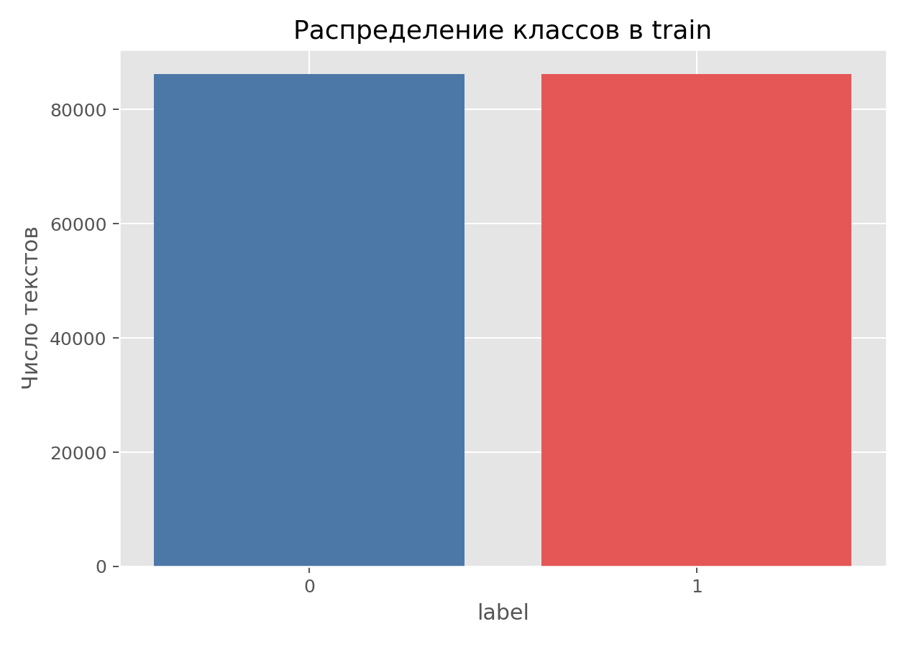
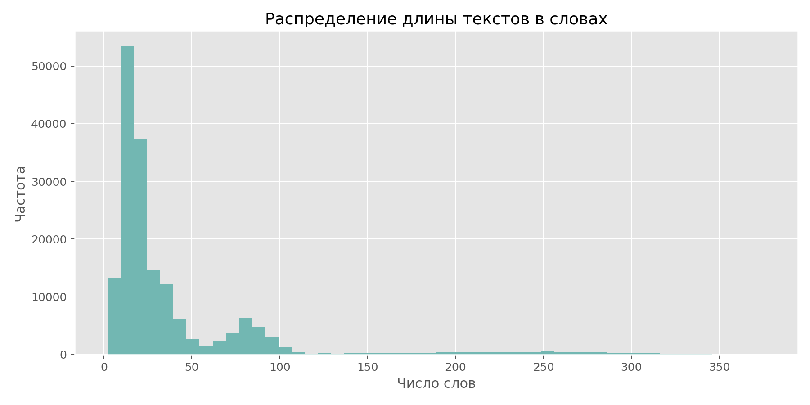
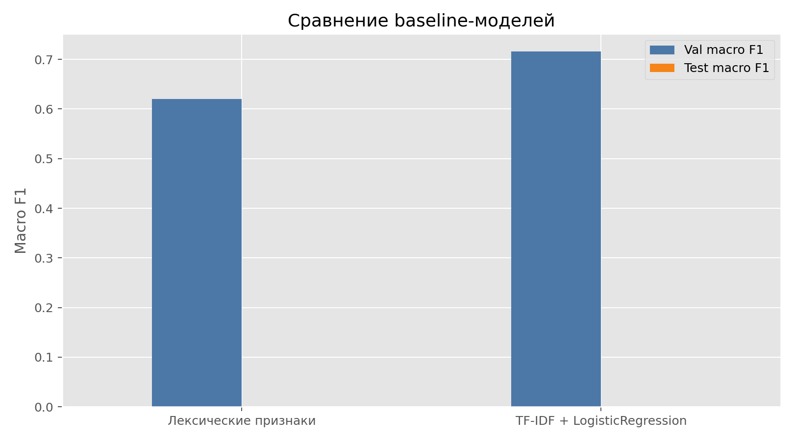
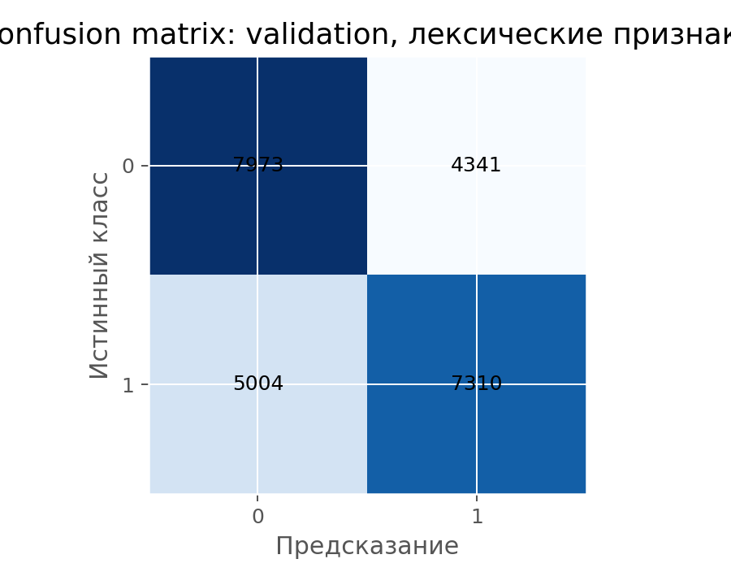
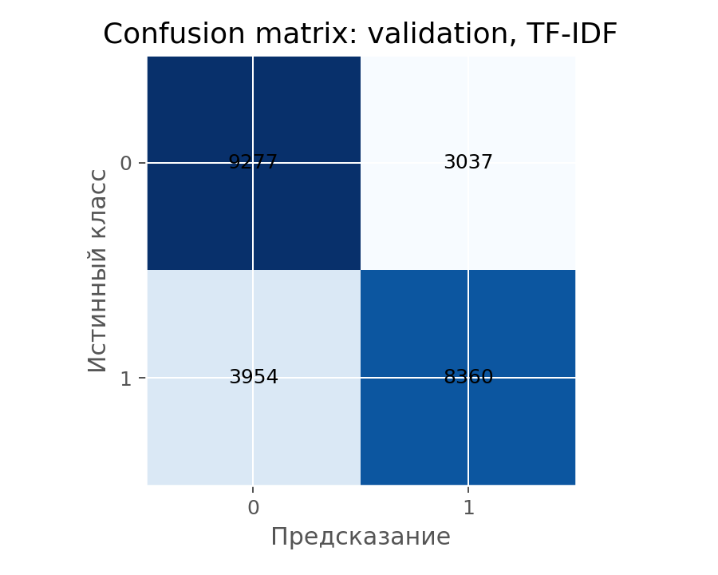

# Отчет по дополнительной задаче: детекция искусственно сгенерированных текстов

## 1. Постановка задачи

В этой задаче требуется различать тексты, написанные человеком, и машинно-сгенерированные тексты на материале корпуса `CoAT` в конфигурации `binary`.

Работа построена как baseline-анализ: сначала рассматриваются простые свойства датасета и текста, затем обучаются две модели — на лексических агрегатах и на `TF-IDF` признаках.

## 2. Структура датасета

| Сплит      | Число текстов   |
|:-----------|:----------------|
| train      | 172 398         |
| validation | 24 628          |
| test       | 48 714          |

|   Класс |   Доля |
|--------:|-------:|
|       0 |    0.5 |
|       1 |    0.5 |

Обучающая выборка полностью сбалансирована: в `train` одинаковое число текстов обоих классов.

## 3. Длины текстов и простые признаки

| Сплит      |   Средняя длина в символах |   Средняя длина в словах |   Медианная длина в словах |
|:-----------|---------------------------:|-------------------------:|---------------------------:|
| train      |                    292.06  |                   39.614 |                         20 |
| validation |                    296.333 |                   40.183 |                         20 |
| test       |                    330.073 |                   44.316 |                         20 |

Средние лексические признаки по `train`:

|   Класс |   token_count |   unique_count |   avg_token_length |   type_token_ratio |   hapax_ratio |   digit_share |
|--------:|--------------:|---------------:|-------------------:|-------------------:|--------------:|--------------:|
|       0 |       33.2444 |        28.1078 |             6.0746 |             0.9249 |        0.934  |        0.0128 |
|       1 |       43.9255 |        41.2595 |             5.9109 |             0.9432 |        0.9426 |        0.0121 |

У класса `1` тексты в среднем длиннее и показывают более высокие `unique_count`, `type_token_ratio` и `hapax_ratio`. Значит, даже простые агрегированные характеристики уже содержат полезный сигнал для классификации.

## 4. Baseline-модели

| Модель                      |   Val accuracy |   Val macro F1 | Test accuracy   | Test macro F1   |
|:----------------------------|---------------:|---------------:|:----------------|:----------------|
| Лексические признаки        |         0.6206 |         0.6203 | —               | —               |
| TF-IDF + LogisticRegression |         0.7161 |         0.7157 | —               | —               |

Модель на простых лексических признаках дает `Val macro F1 = 0.6203`, а модель `TF-IDF + LogisticRegression` заметно сильнее и достигает `0.7157`.

## 5. Особенность test-сплита

У опубликованного `test`-сплита в конфигурации `binary` нет истинных меток: там во всех строках `label = -1`. Поэтому корректно считать тестовые `accuracy` и `F1` здесь нельзя; вместо этого можно анализировать только предсказания моделей на test.

| Модель                      |   Доля предсказаний класса 0 |   Доля предсказаний класса 1 |
|:----------------------------|-----------------------------:|-----------------------------:|
| Лексические признаки        |                       0.5574 |                       0.4426 |
| TF-IDF + LogisticRegression |                       0.5284 |                       0.4716 |

На неразмеченном `test` модель на лексических признаках относит примерно `44.26%` текстов к классу `1`, а `TF-IDF`-модель — примерно `47.16%`.

## 6. Итоговые выводы

- Простые статистические признаки текста дают рабочий baseline, но заметно уступают частотной модели на словах и биграммах.
- Для задачи детекции важны не только длина и разнообразие словаря, но и конкретное содержимое текста.
- Даже линейная модель на `TF-IDF` показывает, что у human и generated текстов есть устойчивые различия, заметные уже без сложных нейросетевых моделей.
- При интерпретации результатов важно учитывать, что test-сплит в текущей конфигурации не размечен.
