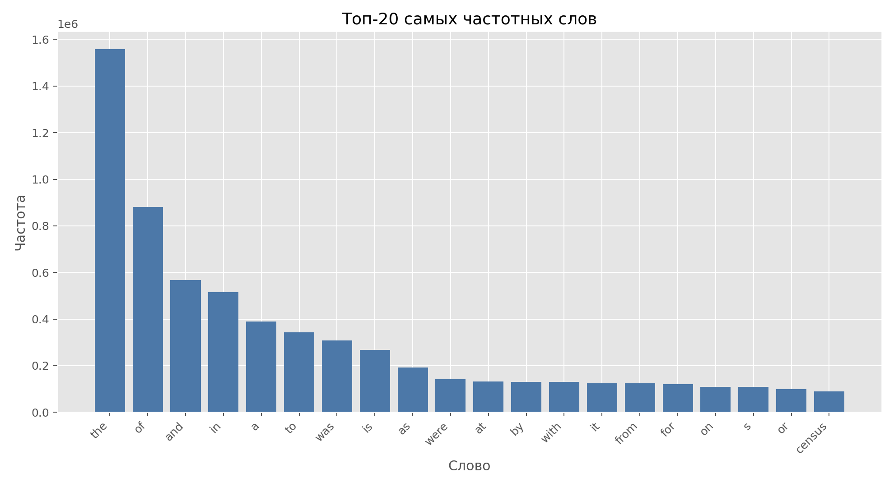
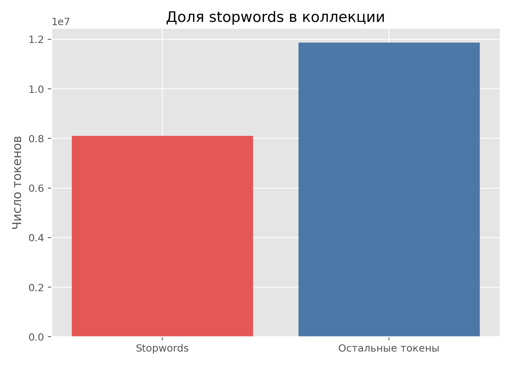
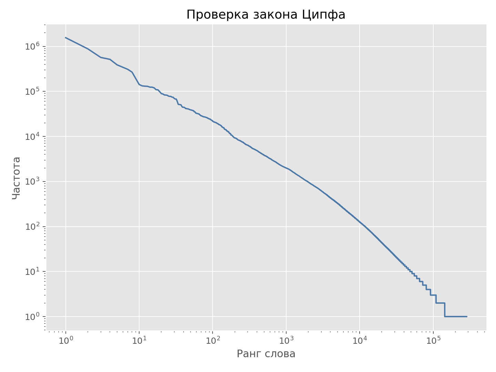
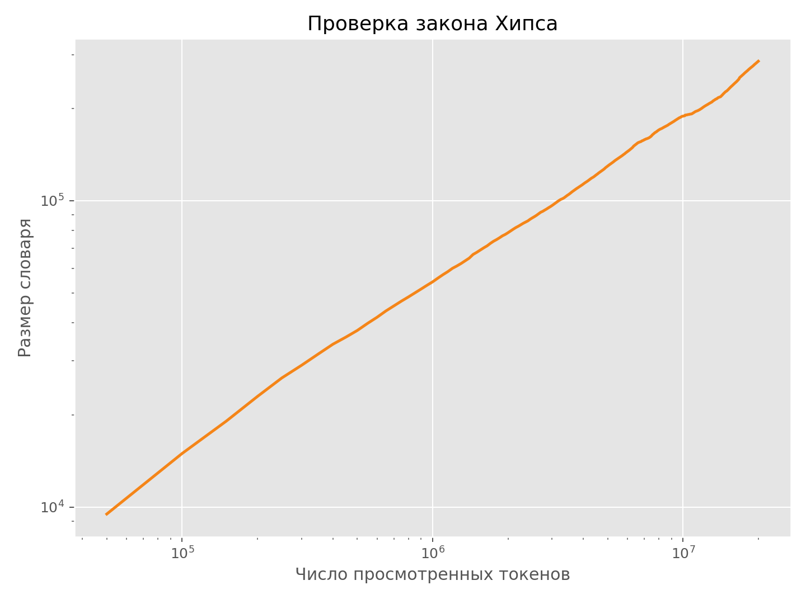
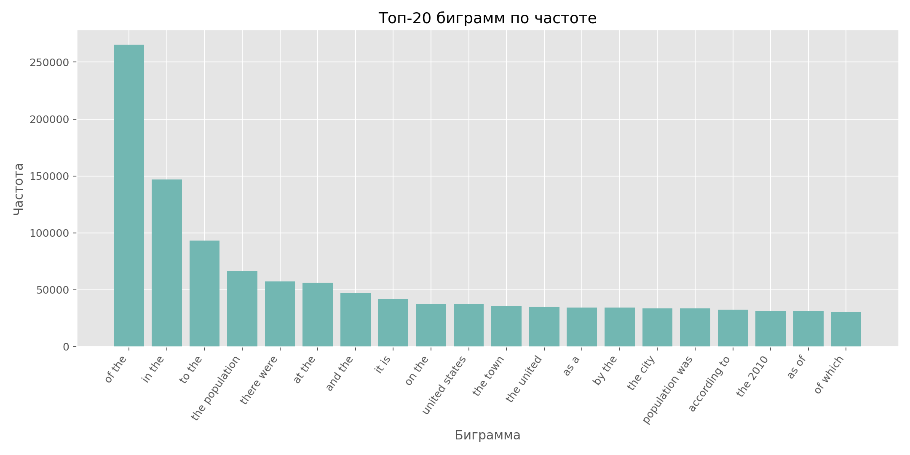
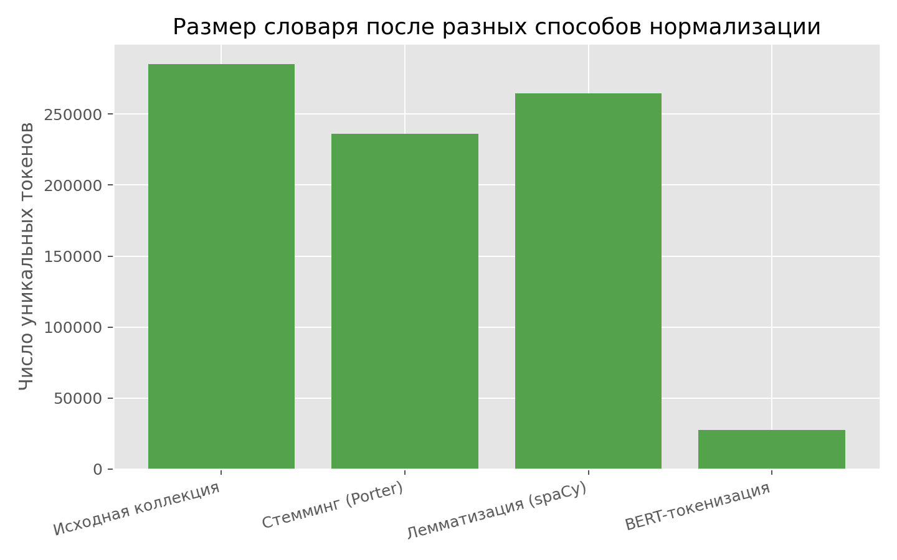
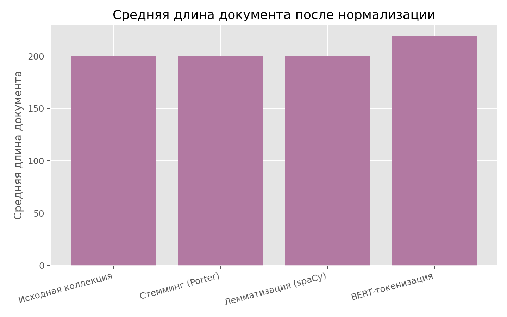

# Отчет по основной части ДЗ1

## 1. Постановка задачи

В основной части работы нужно проанализировать коллекцию `WikIR en1k`: посчитать базовые статистики, исследовать частотное распределение слов, проверить законы Ципфа и Хипса, проанализировать биграммы и сравнить несколько способов нормализации текста.

Для анализа использовался файл `documents.csv` из коллекции `wikIR1k`. В условии указано, что документы уже очищены, приведены к нижнему регистру и токенизированы, поэтому базовая единица анализа в отчете — готовый токен.

## 2. Базовые статистики коллекции

| Показатель                      | Значение   |
|:--------------------------------|:-----------|
| Число документов                | 99 987     |
| Размер коллекции в токенах      | 19 963 076 |
| Средняя длина документа         | 199.6567   |
| Число уникальных слов           | 285 376    |
| Средняя длина слова             | 4.6934     |
| Средняя длина уникального слова | 7.5235     |

Эти числа показывают, что коллекция достаточно крупная для корпусного анализа: почти сто тысяч документов и около двадцати миллионов токенов. При этом словарь корпуса очень большой, что естественно для энциклопедического домена.

## 3. Частотный словарь слов и stopwords

### Топ-10 самых частотных слов

| Слово   |   Частота |   Ранг | Stopword   |
|:--------|----------:|-------:|:-----------|
| the     |   1557812 |      1 | Да         |
| of      |    881627 |      2 | Да         |
| and     |    567768 |      3 | Да         |
| in      |    515312 |      4 | Да         |
| a       |    389090 |      5 | Да         |
| to      |    343354 |      6 | Да         |
| was     |    308940 |      7 | Да         |
| is      |    267701 |      8 | Да         |
| as      |    191301 |      9 | Да         |
| were    |    142334 |     10 | Да         |

Stopwords дают 8 101 999 вхождений, то есть 40.58% всех токенов коллекции. Не все слова из top-30 являются стоп-словами: среди частотных содержательных токенов встречаются `census`, `population`, а также числовые токены `0` и `1`.

По этим результатам видно, что классический stopword list полезен, но не должен расширяться автоматически по сырым частотам корпуса: частотное слово может быть доменно значимым, а не служебным.

## 4. Законы Ципфа и Хипса

На log-log графике зависимости `rank-frequency` наблюдается типичное почти линейное поведение: небольшое число слов имеет очень высокую частоту, а основная масса слов редка. Это соответствует закону Ципфа.

График роста словаря показывает сублинейный рост: по мере чтения новых токенов словарь продолжает расширяться, но скорость появления новых слов постепенно падает. Это соответствует закону Хипса.

## 5. Частотный словарь биграмм

В коллекции получилось `4 083 973` уникальных биграммы. Верхушка списка по сырой частоте сильно засорена служебными сочетаниями, поэтому для отбора полезных биграмм нужен отдельный критерий.

### Топ-10 биграмм по частоте

| Биграмма       |   Частота |
|:---------------|----------:|
| of the         |    265328 |
| in the         |    147038 |
| to the         |     93293 |
| the population |     66719 |
| there were     |     57311 |
| at the         |     56370 |
| and the        |     47362 |
| it is          |     41907 |
| on the         |     37815 |
| united states  |     37437 |

### Биграммы, прошедшие формальный критерий отбора

В качестве рабочего критерия использовалась комбинация условий: `frequency >= 20`, биграмма не должна состоять из двух stopwords одновременно, а мера ассоциации `PMI` должна быть не меньше `3`.

| Биграмма           |   Частота |    PMI | Оба stopword   |
|:-------------------|----------:|-------:|:---------------|
| united states      |     37437 | 8.776  | Нет            |
| according to       |     32694 | 5.8653 | Нет            |
| 2010 census        |     28839 | 7.311  | Нет            |
| census bureau      |     24198 | 7.7811 | Нет            |
| square mile        |     21891 | 9.2054 | Нет            |
| population density |     21185 | 6.9827 | Нет            |
| housing units      |     19597 | 9.8318 | Нет            |
| racial makeup      |     19168 | 9.9902 | Нет            |
| per square         |     21561 | 9.0869 | Нет            |
| total area         |     25302 | 8.2083 | Нет            |

Такой критерий лучше отделяет реально содержательные словосочетания от служебных пар. Среди отобранных биграмм особенно полезными для индекса выглядят `united states`, `according to`, `2010 census`, `population was` и другие устойчивые сочетания с высокой ассоциацией.

## 6. Сравнение способов нормализации текста

| Версия               | Число документов   | Размер коллекции в токенах   |   Средняя длина документа | Число уникальных токенов   |   Средняя длина токена |   Средняя длина уникального токена |
|:---------------------|:-------------------|:-----------------------------|--------------------------:|:---------------------------|-----------------------:|-----------------------------------:|
| Исходная коллекция   | 99 987             | 19 963 076                   |                   199.657 | 285 376                    |                 4.6934 |                             7.5235 |
| Стемминг (Porter)    | 99 987             | 19 963 076                   |                   199.657 | 235 971                    |                 4.1704 |                             6.9654 |
| Лемматизация (spaCy) | 99 987             | 19 965 288                   |                   199.679 | 264 450                    |                 4.4876 |                             7.3948 |
| BERT-токенизация     | 99 987             | 21 931 437                   |                   219.343 | 27 426                     |                 4.4517 |                             6.6324 |

Стемминг через Porter сокращает словарь сильнее всего: с 285 376 до 235 971, то есть примерно на 17.31%. Лемматизация через spaCy уменьшает словарь мягче, до 264 450, то есть примерно на 7.33%. BERT-токенизация дает принципиально другой эффект: словарь резко сжимается до 27 426, но средняя длина документа возрастает до 219.3429, потому что слова разбиваются на подслова.

## 7. Итоговые выводы

- Коллекция `WikIR en1k` демонстрирует типичную для IR-корпусов структуру: тяжелый хвост распределения слов, большое число редких токенов и высокую долю stopwords.
- Законы Ципфа и Хипса на данных подтверждаются визуально: это согласуется с ожидаемым поведением естественного текста в больших коллекциях.
- Для биграмм одной частоты недостаточно: нужны формальные критерии на основе частоты, stopwords и ассоциативной меры вроде PMI.
- Стемминг сильнее всего сжимает словарь, лемматизация делает это аккуратнее, а BERT-токенизация не является прямой заменой словарной нормализации, потому что переходит к subword-представлению.
