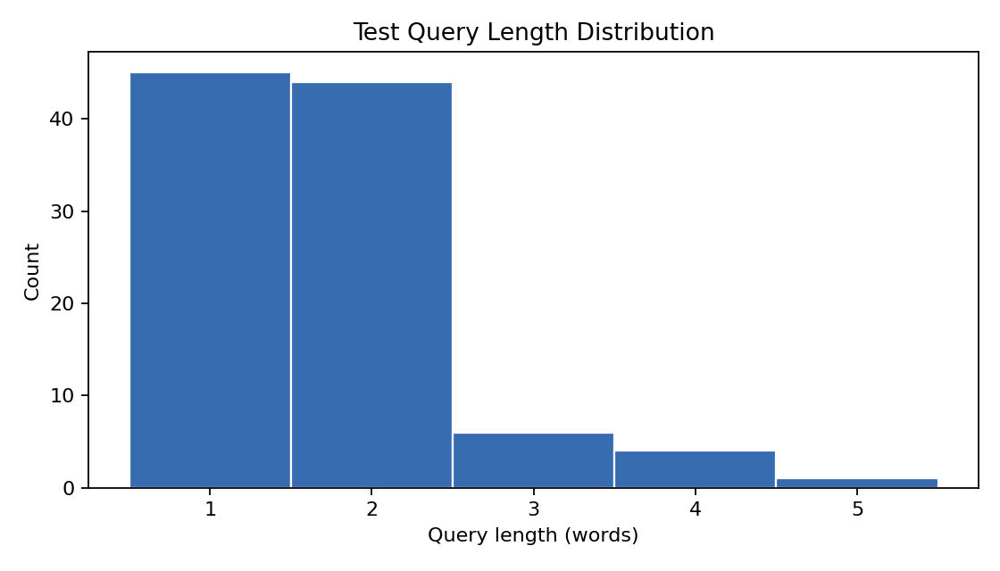
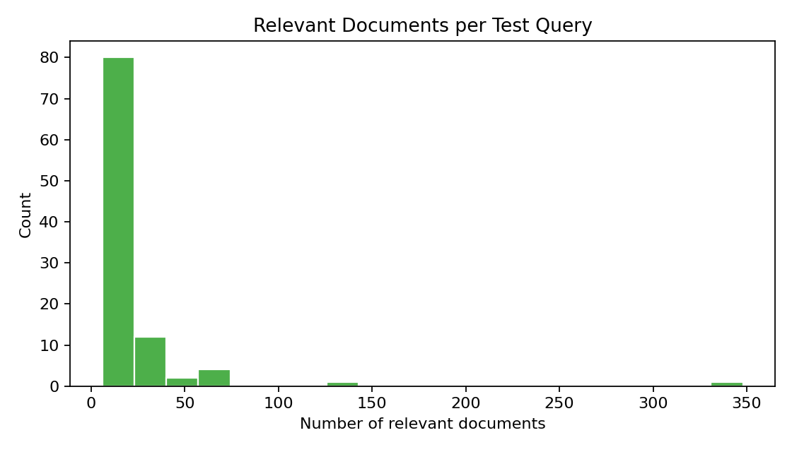
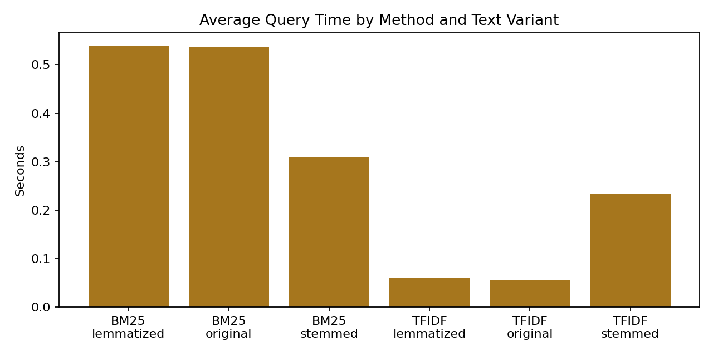
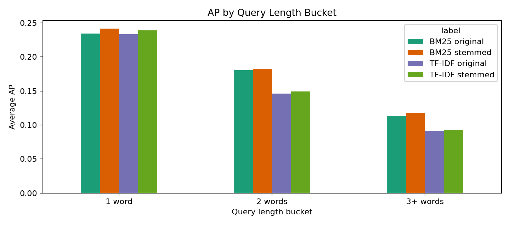
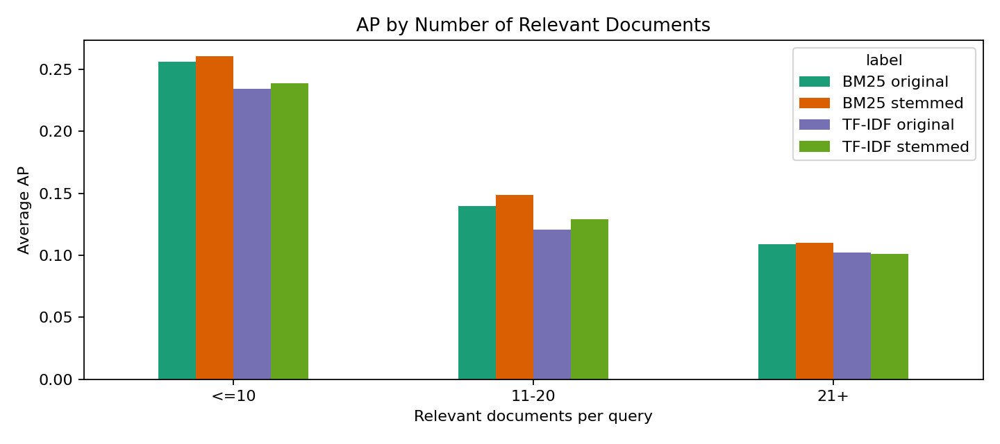
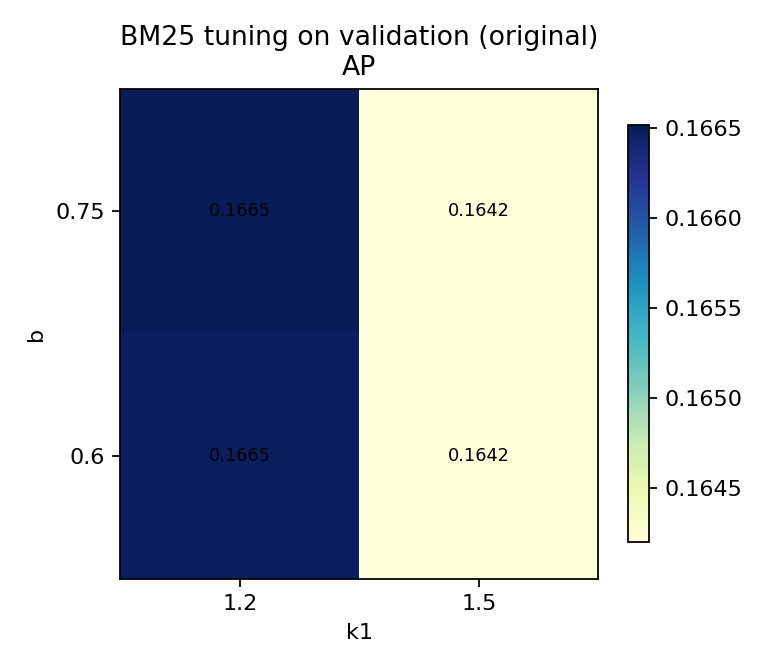
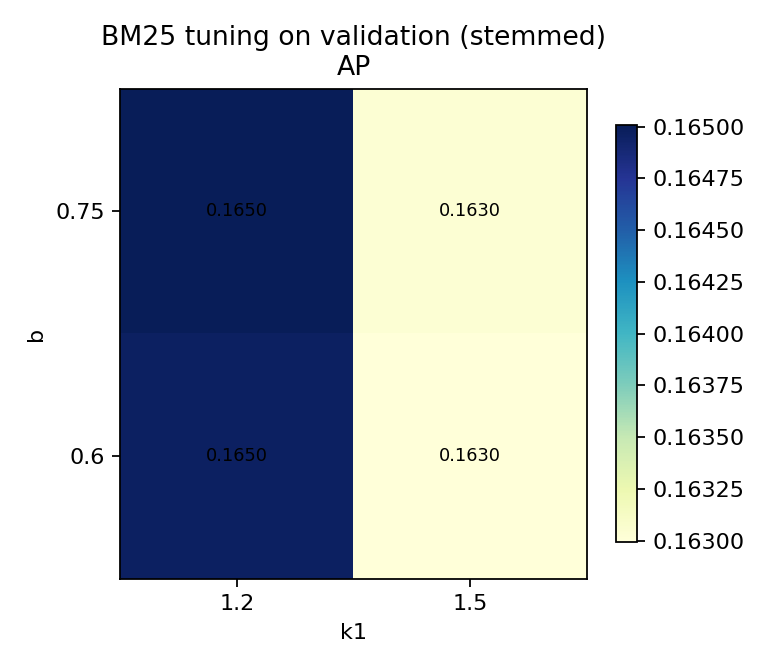
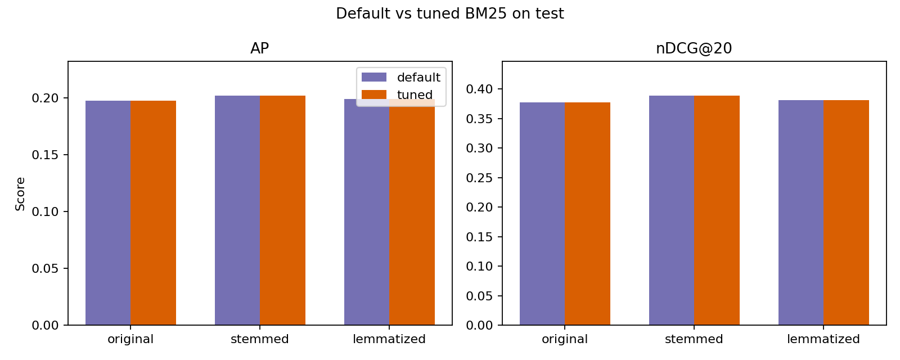

# Отчет по основной части ДЗ2

## 1. Постановка задачи

Исследуем ранжирование на коллекции `WikIR en1k` и сравним два подхода к поиску: `tf-idf` и `BM25`

Сравнение проводится на трех вариантах текста:
- `original`
- `stemmed`
- `lemmatized`

Для всех основных прогонов нужно:

- получить результаты поиска на тестовых запросах;
- сохранить выдачу в формате `TREC run`;
- оценить качество через `ir-measures`;
- сравнить метрики;
- проанализировать сильные и слабые стороны методов и вариантов морфологической обработки.

Отдельно требуется подобрать параметры `BM25` (`k1`, `b`) на валидационном наборе и сравнить настроенную модель с моделью по умолчанию.

## 2. Данные

Предварительно видно, что:

- документы уже лежат в виде очищенного текста;
- запросы хранятся в `queries.csv`;
- `qrels` имеют классический TREC-вид `query_id iteration doc_id relevance`;
- в `qrels` используется градуированная релевантность, по крайней мере значения `1` и `2`.

После первичного аудита получаем следующую сводку по набору:

| Объект | Значение |
|:--|--:|
| Число документов | 99 987 |
| Пустые документы | 0 |
| Число токенов в коллекции | 19 963 076 |
| Средняя длина документа | 199.66 |
| Минимальная длина документа | 13 |
| Максимальная длина документа | 200 |
| Число train-запросов | 1 645 |
| Число validation-запросов | 100 |
| Число test-запросов | 100 |

Отдельно важно, что проверки целостности не выявили проблем:

- пустых запросов нет;
- запросов без qrels нет;
- qrels без соответствующих запросов нет;
- qrels, ссылающихся на отсутствующие документы, нет.

## 3. Происхождение коллекции и разметки

По статье `WIKIR: A Python Toolkit for Building a Large-scale Wikipedia-based English Information Retrieval Dataset` запросы и разметка строятся автоматически из структуры Wikipedia.

Ключевая идея такая:

- тема статьи Wikipedia считается её главным предметом;
- запрос строится как краткое описание темы, в базовом варианте это заголовок статьи;
- документ строится из полного текста статьи, но без заголовка и без первого предложения;
- релевантность задаётся по тому, связана ли статья-документ с темой запроса.

Для Wikipedia авторы используют два источника тематической связи:

- сама статья релевантна своему собственному заголовку;
- статья также считается связанной с темами тех статей, на которые она ссылается во фразе первого предложения.

Практически это означает следующую интерпретацию `qrels`:

- relevance `2` соответствует паре "запрос и документ построены из одной и той же статьи";
- relevance `1` соответствует случаю, когда в первом предложении документа есть внутренняя ссылка на статью, из которой построен запрос.

Это объясняет две важные особенности набора:

- запросы очень короткие, потому что фактически это названия статей;
- часть положительных документов может быть только косвенно связана с запросом, поэтому среди высоко ранжированных "ошибок" могут встречаться спорные или семантически близкие случаи.

Ещё один вывод из статьи: первое предложение удаляется из документа специально, чтобы модель не пользовалась слишком прямой подсказкой, из которой фактически была построена разметка.

## 4. Статистика по тестовым запросам

Для тестового набора после аудита видим следующее:

| Показатель | Значение |
|:--|--:|
| Число test-запросов | 100 |
| Средняя длина запроса | 1.72 слова |
| Медианная длина запроса | 2 слова |
| Минимальная длина запроса | 1 слово |
| Максимальная длина запроса | 5 слов |
| Число qrels в test | 2 006 |
| Среднее число релевантных документов на запрос | 20.06 |
| Медиана релевантных документов на запрос | 10 |
| Минимум релевантных документов на запрос | 6 |
| Максимум релевантных документов на запрос | 348 |

Предварительное наблюдение: тестовые запросы очень короткие, в среднем меньше двух слов. Это означает, что морфологическая нормализация и качество сопоставления терминов могут влиять на результат заметно сильнее, чем в длинных запросах.

По ним видно два свойства набора:

- длина запросов сильно сосредоточена около `1-2` слов;
- число релевантных документов на запрос неравномерно и имеет длинный хвост, то есть в тесте есть как "узкие", так и "широкие" информационные потребности.

## 5. Методика экспериментов

Во всех экспериментах использовались три варианта текста:

- `original`: исходные токены из `WikIR`;
- `stemmed`: `PorterStemmer` поверх исходных токенов;
- `lemmatized`: lookup-лемматизация `spaCy`.

### 5.1. `tf-idf`

Для `tf-idf` использовался `sklearn.feature_extraction.text.TfidfVectorizer` со следующими параметрами:

- `tokenizer=str.split`
- `preprocessor=None`
- `lowercase=False`
- `token_pattern=None`
- `use_idf=True`
- `norm='l2'`

То есть векторизатор работал поверх уже подготовленных токенов, без дополнительной нормализации внутри `sklearn`.

### 5.2. `BM25`

Для `BM25` использовалась реализация `rank_bm25.BM25Okapi`.

Дефолтная конфигурация:

- `k1 = 1.5`
- `b = 0.75`

Для настройки в предварительных экспериментах использовалась малая сетка:

- `k1 in {1.2, 1.5}`
- `b in {0.6, 0.75}`

### 5.3. Формат run и оценка

Все результаты поиска сохранялись в формате `TREC run`:

- `query_id`
- `Q0`
- `doc_id`
- `rank`
- `score`
- `run_id`

Оценка выполнялась через `ir_measures` по пяти метрикам:

- `P@1`
- `P@10`
- `P@20`
- `AP`
- `nDCG@20`

Параметры метрик в нашей постановке:

- `P@1`: precision at cutoff `1`
- `P@10`: precision at cutoff `10`
- `P@20`: precision at cutoff `20`
- `AP`: average precision по полному ранжированию; при агрегировании по набору запросов это соответствует `MAP`
- `nDCG@20`: normalized discounted cumulative gain at cutoff `20`

Кроме агрегированных значений отдельно сохранялись результаты по каждому запросу, чтобы анализировать лёгкие и трудные запросы.

## 6. Основные результаты

### 6.1. Сводная таблица по всем базовым прогонам

| Метод | Вариант | P@1 | P@10 | P@20 | MAP | nDCG@20 | Среднее время на запрос, сек |
|:--|:--|--:|--:|--:|--:|--:|--:|
| `tf-idf` | `original` | 0.44 | 0.212 | 0.1505 | 0.1794 | 0.3458 | 0.0567 |
| `tf-idf` | `stemmed` | 0.49 | 0.214 | 0.1510 | 0.1836 | 0.3594 | 0.2342 |
| `tf-idf` | `lemmatized` | 0.46 | 0.212 | 0.1500 | 0.1812 | 0.3503 | 0.0608 |
| `BM25` | `original` | 0.49 | 0.236 | 0.1690 | 0.1975 | 0.3776 | 0.5377 |
| `BM25` | `stemmed` | 0.51 | 0.235 | 0.1710 | 0.2020 | 0.3892 | 0.3088 |
| `BM25` | `lemmatized` | 0.51 | 0.234 | 0.1670 | 0.1990 | 0.3810 | 0.5399 |

Сводная таблица по уже выполненным экспериментам хранится в:

Первые устойчивые выводы уже видны:

- `BM25` лучше `tf-idf` на всех трех вариантах текста по всем основным метрикам.
- Лучший результат по `AP` и `nDCG@20` среди базовых прогонов сейчас у `BM25 + stemmed`.
- Для `tf-idf` стемминг тоже оказался лучшим вариантом из трех.
- Лемматизация помогает относительно `original`, но пока уступает стеммингу.

### 6.2. Original: `tf-idf` vs `BM25`

На `original`-тексте `BM25` лучше `tf-idf` по всем пяти метрикам:

- `P@1`: `0.49` против `0.44`
- `AP`: `0.1975` против `0.1794`
- `nDCG@20`: `0.3776` против `0.3458`

Это хороший базовый ориентир: даже без морфологической нормализации `BM25` уже даёт более сильную выдачу.

### 6.3. Что меняется после стемминга

Для `stemmed`-варианта уже получены ещё две полноразмерные строки:

| Прогон | P@1 | P@10 | P@20 | AP | nDCG@20 | Среднее время на запрос, сек | Время подготовки, сек |
|:--|--:|--:|--:|--:|--:|--:|--:|
| `tfidf_stemmed_test` | 0.49 | 0.2140 | 0.1510 | 0.1836 | 0.3594 | 0.2342 | 162.45 |
| `bm25_stemmed_test_k1_1.5_b_0.75` | 0.51 | 0.2350 | 0.1710 | 0.2020 | 0.3892 | 0.3088 | 162.11 |

Предварительное наблюдение: `Porter`-стемминг даёт небольшой, но заметный прирост качества:

- у `tf-idf` `P@1` вырос с `0.44` до `0.49`, а `AP` с `0.1794` до `0.1836`;
- у `BM25` `P@1` вырос с `0.49` до `0.51`, а `AP` с `0.1975` до `0.2020`.

При этом цена стемминга очень заметна на этапе подготовки корпуса: около `162s` против `4s` у `original`. То есть на коротких запросах стемминг пока выглядит полезным по качеству, но далеко не бесплатным по вычислениям.

### 6.4. Что даёт лемматизация

Лемматизация тоже помогает относительно `original`, но эффект у неё мягче, чем у стемминга:

- `tf-idf + lemmatized` даёт `AP = 0.1812`, что выше `original`, но ниже `stemmed`;
- `BM25 + lemmatized` даёт `AP = 0.1990`, что тоже выше `original`, но ниже `BM25 + stemmed`;
- по `P@1` у `BM25` лемматизация и стемминг сейчас совпали: `0.51`.

На вычислениях картина тоже показательна:

- первый запуск `lemmatized` дорог из-за построения лемматизированного кэша;
- после кэширования повторные прогоны идут заметно дешевле по `preprocess_seconds`.

Это будет полезно на этапе тюнинга `BM25`, где придётся повторять много validation-прогонов.

## 7. Анализ

Аналитика по отдельным запросам уже собрана в отдельных таблицах:

### 7.1. Легкие и трудные запросы

Если смотреть на лучший базовый прогон `BM25 + stemmed` по `nDCG@20`, самыми лёгкими оказываются в основном короткие и хорошо определённые сущностные запросы:

- `aruba`
- `porsche`
- `dartmoor`
- `korn`
- `xml`

Самыми трудными оказываются более неоднозначные или широкие запросы:

- `e`
- `baron`
- `s`
- `heavy metal music`
- `ancient greek`

 Чем короче и однозначнее название сущности, тем проще моделям точного совпадения вроде `tf-idf` и `BM25` поднять правильные документы наверх.

### 7.2. Влияние длины запроса

По всем шести базовым прогонам длина запроса имеет отрицательную корреляцию с качеством. Для `BM25` эффект умеренный, для `tf-idf` немного сильнее. Например, для `BM25 + stemmed`:

- запросы длиной `1` слово дают `AP = 0.2415`;
- запросы длиной `2` слова дают `AP = 0.1827`;
- запросы длиной `3+` слова дают `AP = 0.1177`.

То есть в этом наборе короткие запросы в среднем легче длинных. Это согласуется с устройством `WikIR`: многие запросы здесь являются заголовками статей и хорошо соответствуют конкретным сущностям.

### 7.3. Влияние числа релевантных документов

Более сильный эффект даёт число релевантных документов на запрос: корреляция с качеством стабильно отрицательная для всех моделей.

Например, для `BM25 + stemmed`:

- при `<=10` релевантных документах средний `AP = 0.2604`;
- при `11-20` релевантных документах `AP = 0.1488`;
- при `21+` релевантных документах `AP = 0.1101`.

Это означает, что широкие запросы с большим числом потенциально релевантных документов на практике сложнее. Вероятная причина в том, что они часто более многозначны или покрывают более разнородный тематический кластер.

### 7.4. Сравнение методов и морфологической обработки

По уже полученным результатам:

- `BM25` стабильно лучше `tf-idf` по всем пяти метрикам;
- стемминг даёт лучший эффект среди трёх вариантов предобработки;
- лемматизация тоже помогает, но слабее;
- разница между `stemmed` и `lemmatized` особенно заметна у `BM25` по `AP` и `nDCG@20`.

Пока наиболее сильный базовый вариант в нашей постановке: `BM25 + stemmed`

Следующим шагом в анализе остается попробовать ручной разбор высоко ранжированных документов, размеченных как нерелевантные, чтобы понять, где ошибка действительно модели, а где вопрос к структуре `WikIR qrels`.

### 7.5. Примеры высоко ранжированных нерелевантных документов

Быстрый ручной просмотр высоко ранжированных нерелевантных документов для `BM25 + stemmed` показывает, что причины бывают разными.

1. Чистое лексическое ложное совпадение.

- запрос: `html`
- самый высокий нерелевантный документ: текст про `HTML Kit`, то есть про редактор для HTML

Почему модель подняла его наверх: в документе очень плотное совпадение по токену `html`. Для модели точного совпадения это сильный сигнал, хотя документ не является основной статьёй про сам язык разметки.

2. Тематически близкий, но слишком широкий контекст.

- запрос: `chicago blues`
- самый высокий нерелевантный документ: текст про развитие электрогитары, где упоминается `post war ii chicago blues`

Почему он высоко: документ содержит точное совпадение и связан с той же музыкальной областью. Но с точки зрения qrels он не является тем самым целевым документом или явно связанным документом по правилу WIKIR.

3. Вероятно спорный случай в qrels.

- запрос: `french and indian war`
- самый высокий нерелевантный документ: текст, который буквально начинается с объяснения, что название `french and indian war` используется в США для войны `1754-63`

Здесь уже неочевидно, что модель ошибается. По смыслу документ выглядит очень близким к запросу, и такой пример скорее указывает на ограничения автоматической разметки `WikIR`, чем на явный промах ранжирования.

Это важный вывод для интерпретации результатов: не все высоко ранжированные "ошибки" одинаковы. Часть из них действительно вызвана поверхностным лексическим совпадением, но часть связана с тем, что `WikIR` строит `qrels` автоматически и не покрывает все семантически разумные релевантные документы.

## 8. Тюнинг BM25

Первый тюнинг на валидации выполнен для варианта `original`. В качестве рабочей метрики оптимизации использовал `AP`.

### 8.1. Предварительный тюнинг на валидации для `original`

Для быстрой проверки запустил маленькую сетку:

- `k1`: `1.2`, `1.5`
- `b`: `0.6`, `0.75`

Лучшая пара на `validation` по `AP`:

- `k1 = 1.2`
- `b = 0.75`
- `AP = 0.1665`
- `nDCG@20 = 0.3470`

### 8.2. Параметры по умолчанию против настроенных на тесте для `original`

Кандидат `k1 = 1.2, b = 0.75`, найденный на `validation`, был отдельно проверен на `test`.

| Конфигурация | P@1 | P@10 | P@20 | AP | nDCG@20 |
|:--|--:|--:|--:|--:|--:|
| `BM25 по умолчанию (k1=1.5, b=0.75)` | 0.49 | 0.2360 | 0.1690 | 0.1975 | 0.3776 |
| `BM25 после настройки (k1=1.2, b=0.75)` | 0.49 | 0.2350 | 0.1700 | 0.1974 | 0.3774 |

Пока вывод осторожный: на этом маленьком валидационном наборе найденный кандидат не дал выигрыша на `test`. Разница очень мала и по ключевым метрикам фактически отсутствует.

Это означает две вещи:

- параметры `Rank-BM25` по умолчанию уже являются сильным базовым вариантом для `WikIR`;
- для уверенного вывода о тюнинге нужна либо более широкая сетка, либо отдельный анализ устойчивости по запросам.

### 8.3. Предварительный тюнинг для `stemmed`

Для `stemmed` на той же маленькой валидационной сетке лучшей снова оказалась пара:

- `k1 = 1.2`
- `b = 0.75`

На валидации для неё получено:

- `AP = 0.1650`
- `nDCG@20 = 0.3433`

После переноса на `test` сравнение получилось таким:

| Конфигурация | P@1 | P@10 | P@20 | AP | nDCG@20 |
|:--|--:|--:|--:|--:|--:|
| `BM25 stemmed по умолчанию (k1=1.5, b=0.75)` | 0.51 | 0.2350 | 0.1710 | 0.2020 | 0.3892 |
| `BM25 stemmed после настройки (k1=1.2, b=0.75)` | 0.51 | 0.2370 | 0.1710 | 0.2021 | 0.3892 |

Здесь есть очень небольшой прирост по `P@10` и `AP`, но он минимален. Практический вывод пока тот же: даже у лучшего базового варианта `BM25` по умолчанию уже находится очень близко к локальному оптимуму на нашей маленькой сетке.

### 8.4. Предварительный тюнинг для `lemmatized`

Для `lemmatized` на той же сетке лучшая пара снова:

- `k1 = 1.2`
- `b = 0.75`

На валидации для неё получено:

- `AP = 0.1673`
- `nDCG@20 = 0.3460`

На `test` сравнение получилось таким:

| Конфигурация | P@1 | P@10 | P@20 | AP | nDCG@20 |
|:--|--:|--:|--:|--:|--:|
| `BM25 lemmatized по умолчанию (k1=1.5, b=0.75)` | 0.51 | 0.2340 | 0.1670 | 0.1990 | 0.3810 |
| `BM25 lemmatized после настройки (k1=1.2, b=0.75)` | 0.51 | 0.2350 | 0.1680 | 0.1989 | 0.3813 |

Здесь эффект снова минимален: по `P@10`, `P@20` и `nDCG@20` есть микроскопический плюс, но по `AP` улучшения нет.

### 8.5. Общий вывод по предварительному тюнингу

На нашей маленькой валидационной сетке для всех трёх вариантов текста лучший кандидат оказался одинаковым:

- `k1 = 1.2`
- `b = 0.75`

Сводно это выглядит так:

| Вариант | Лучший k1 | Лучший b | AP на валидации | nDCG@20 на валидации |
|:--|--:|--:|--:|--:|
| `original` | 1.2 | 0.75 | 0.1665 | 0.3470 |
| `stemmed` | 1.2 | 0.75 | 0.1650 | 0.3433 |
| `lemmatized` | 1.2 | 0.75 | 0.1673 | 0.3460 |

Но на `test` это не приводит к заметному и устойчивому улучшению относительно дефолтного `BM25`.

| Вариант | Изменение P@10 | Изменение P@20 | Изменение MAP | Изменение nDCG@20 |
|:--|--:|--:|--:|--:|
| `original` | -0.0010 | +0.0010 | -0.0001 | -0.0003 |
| `stemmed` | +0.0020 | 0.0000 | +0.0001 | 0.0000 |
| `lemmatized` | +0.0010 | +0.0010 | 0.0000 | +0.0003 |

- дефолтные параметры `BM25` уже очень сильны для `WikIR en1k`;
- если и искать выигрыш дальше, то нужна более широкая сетка и, возможно, более детальный анализ по отдельным запросам, а не ожидание большого среднего прироста от небольшой локальной подстройки.

Сравнение `BM25` с параметрами по умолчанию и после настройки по всем трём вариантам текста также сведено на графике:

## 9. Выводы

По итогам экспериментов на `WikIR en1k` можно сделать несколько основных выводов.

Во-первых, `BM25` стабильно сильнее `tf-idf` на всех трёх вариантах текста. Разница не огромная, но она устойчива по всем основным метрикам, поэтому для этой задачи `BM25` является более сильным базовым ранкером.

Во-вторых, морфологическая нормализация помогает, но не одинаково. Лучший базовый вариант в нашей постановке оказался `BM25 + stemmed`. Лемматизация тоже улучшает результат относительно `original`, но в среднем уступает стеммингу.

В-третьих, свойства запросов существенно влияют на качество. Самыми лёгкими оказываются короткие и однозначные сущностные запросы, а самыми трудными — короткие, но многозначные, либо тематически широкие запросы. Дополнительно видно, что запросы с большим числом релевантных документов в среднем сложнее для всех моделей.

В-четвёртых, одной метрики недостаточно. `P@1` лучше отражает качество первого результата, тогда как `AP` и `nDCG@20` дают более полную картину поведения ранкера на верхней части списка. В предварительном тюнинге это особенно заметно: небольшие изменения параметров почти не меняют среднюю картину сразу по всем метрикам.

В-пятых, предварительный тюнинг `BM25` на маленьком валидационном наборе не дал заметного выигрыша на `test`. Для всех трёх вариантов текста лучшим кандидатом в нашей маленькой сетке оказался `k1=1.2, b=0.75`, но прирост либо отсутствовал, либо был микроскопическим. Практически это означает, что параметры `BM25` по умолчанию уже очень сильны для этого корпуса.

Главные ограничения текущего эксперимента такие:

- `WikIR` использует автоматически построенные `qrels`, поэтому часть высоко ранжированных "ошибок" может быть спорной по смыслу;
- предварительный тюнинг пока опирается на небольшую сетку параметров;
- ручной разбор ошибок пока сделан на нескольких показательных случаях, а не на большой выборке.
