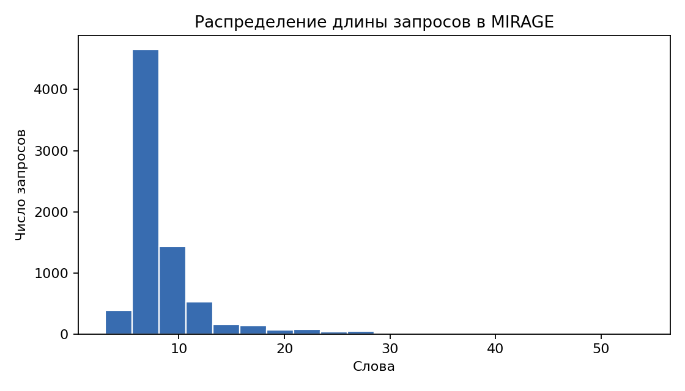
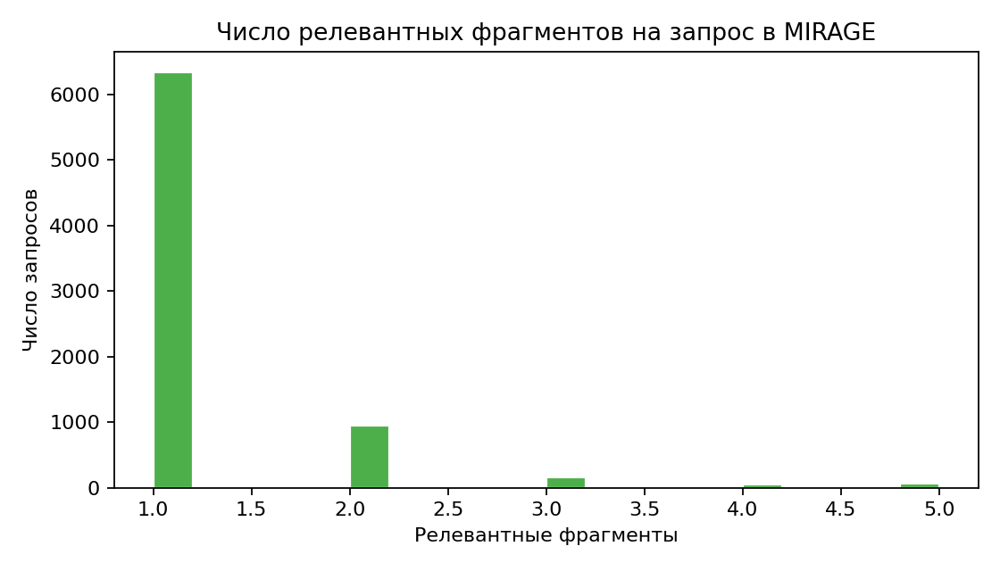
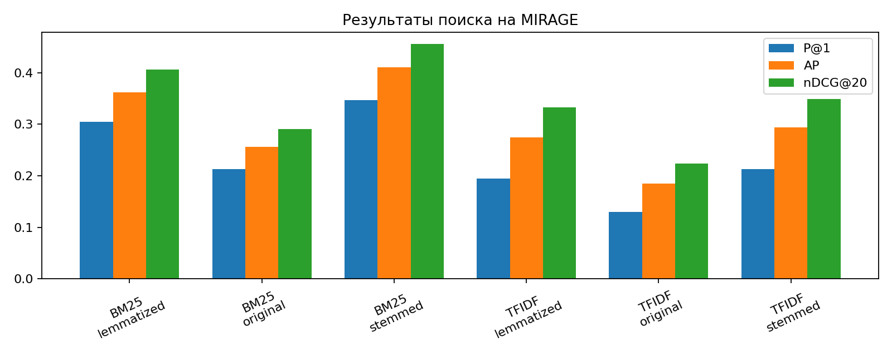
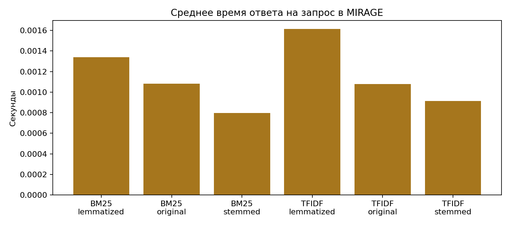
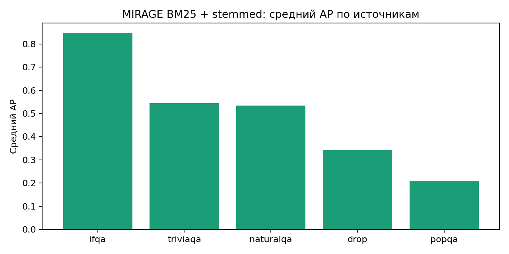
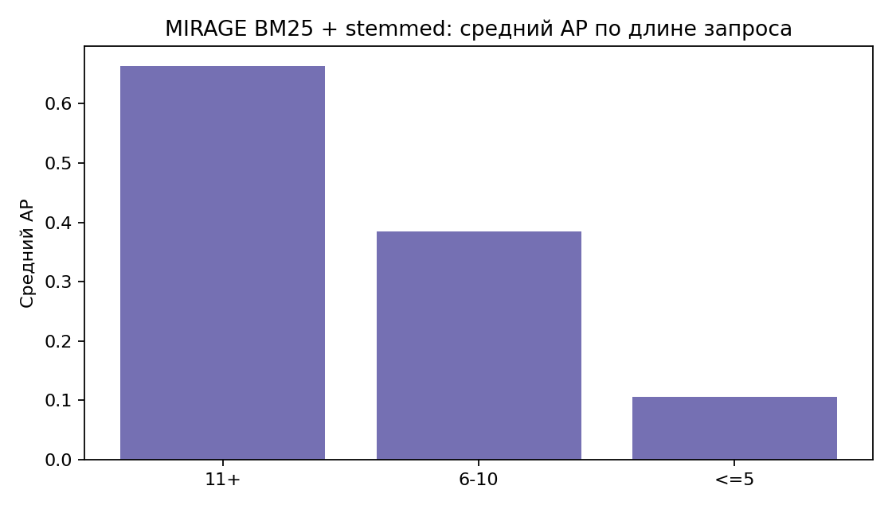

# Отчет по дополнительной задаче: коллекция MIRAGE

## 1. Постановка

Нужно адаптировать `MIRAGE` к IR-постановке:

- собрать единый корпус фрагментов;
- построить `qrels`;
- запустить `tf-idf` и `BM25`;
- оценить качество;
- сравнить результаты с `WikIR`.

## 2. Данные и преобразование коллекции

Cводка по коллекции:

| Показатель | Значение |
|:--|--:|
| Число запросов | 7,560 |
| Число уникальных фрагментов | 37,799 |
| Число qrels | 9,268 |
| Средняя длина запроса | 8.74 слова |
| Среднее число релевантных фрагментов на запрос | 1.23 |
| Средний размер пула кандидатов | 5.0 |

## 3. Методика

Использованы те же два метода, что и в основной части: `tf-idf` и `BM25`. И те же три варианта предобработки: `original`, `stemmed`, `lemmatized`.

Метрики: `P@1`, `P@10`, `P@20`, `AP`, `nDCG@20`

Из инженерных улучшений:

- для поиска по фрагментам использовал эквивалентную разреженную реализацию формулы `BM25`, потому что прямой вызов `rank_bm25.get_scores` для каждого запроса на полном корпусе оказывался слишком дорогим;
- это не меняет саму модель, но делает воспроизводимый полный базовый прогон практически выполнимым по времени.

## 4. Результаты

Сводная таблица базовых прогонов:

| Метод | Вариант | P@1 | P@10 | P@20 | AP | nDCG@20 | Среднее время на запрос, сек |
|:--|:--|--:|--:|--:|--:|--:|--:|
| `tf-idf` | `original` | 0.1295 | 0.0362 | 0.0209 | 0.1847 | 0.2242 | 0.00108 |
| `tf-idf` | `stemmed` | 0.2131 | 0.0550 | 0.0308 | 0.2939 | 0.3488 | 0.00091 |
| `tf-idf` | `lemmatized` | 0.1946 | 0.0533 | 0.0312 | 0.2748 | 0.3325 | 0.00162 |
| `BM25` | `original` | 0.2128 | 0.0426 | 0.0233 | 0.2565 | 0.2902 | 0.00108 |
| `BM25` | `stemmed` | 0.3466 | 0.0651 | 0.0346 | 0.4106 | 0.4555 | 0.00080 |
| `BM25` | `lemmatized` | 0.3044 | 0.0594 | 0.0325 | 0.3620 | 0.4061 | 0.00134 |

\newpage

{ width=82% }

\vspace{0.5cm}

{ width=82% }

Основные наблюдения:

- `BM25` лучше `tf-idf` на всех трех вариантах текста.
- Лучший базовый вариант на `MIRAGE` это `BM25 + stemmed`.
- Морфологическая нормализация на `MIRAGE` помогает намного сильнее, чем на `WikIR`.
- `stemmed` стабильно сильнее `lemmatized`.
- Время поиска почти одинаково для всех вариантов; основная цена морфологии лежит в `preprocess_seconds`, а не в самом ранжировании.

## 5. Анализ по отдельным запросам и разбор ошибок

Отдельно разобрал лучший базовый вариант `BM25 + stemmed` на уровне отдельных запросов.

### 5.1. Какие запросы легче и труднее

По источникам вопросов картина неоднородна:

| Источник | Запросов | Средний AP | Средний nDCG@20 | Средний P@1 | Средняя длина |
|:--|--:|--:|--:|--:|--:|
| `ifqa` | 248 | 0.8477 | 0.8805 | 0.7782 | 22.44 |
| `triviaqa` | 584 | 0.5438 | 0.6032 | 0.5068 | 13.28 |
| `naturalqa` | 3,578 | 0.5337 | 0.5960 | 0.4346 | 8.87 |
| `drop` | 75 | 0.3428 | 0.3717 | 0.2933 | 8.65 |
| `popqa` | 3,075 | 0.2084 | 0.2317 | 0.1802 | 6.64 |

{ width=78% }

Ключевой вывод здесь простой:

- самые легкие запросы приходят из `ifqa`, где вопросы длинные, конкретные и содержат много хорошо различающих терминов;
- самые трудные запросы это `popqa`, где формулировки короткие и часто похожи на шаблон `"Who was the director/author/producer of X?"`;
- `naturalqa` в среднем заметно сильнее `popqa`, но внутри него много нулевых случаев из-за неоднозначности сущностей.

Эффект длины запроса тоже сильный:

| Группа по длине запроса | Запросов | Средний AP | Средний nDCG@20 | Средний P@1 |
|:--|--:|--:|--:|--:|
| `11+` | 1,085 | 0.6635 | 0.7206 | 0.5889 |
| `6-10` | 6,088 | 0.3849 | 0.4284 | 0.3208 |
| `<=5` | 387 | 0.1061 | 0.1395 | 0.0724 |

{ width=78% }

Это хорошо согласуется с интуитивной оценкой: чем длиннее и конкретнее запрос, тем проще лексической модели выделить правильный фрагмент.

### 5.2. Легкие и трудные запросы

В [mirage_easy_queries_bm25_stemmed.csv](artifacts/mirage/tables/mirage_easy_queries_bm25_stemmed.csv) много запросов с `AP = 1.0`. Обычно это вопросы, где:

- есть редкое имя, дата или точное название;
- правильный фрагмент содержит почти буквальное лексическое совпадение;
- в пуле из пяти фрагментов нет сильных конкурирующих сущностей.

В [mirage_hard_queries_bm25_stemmed.csv](artifacts/mirage/tables/mirage_hard_queries_bm25_stemmed.csv) наоборот доминируют `AP = 0.0` кейсы. Типичный профиль такого запроса:

- короткая формулировка;
- одно смысловое ядро вроде `director`, `author`, `producer`;
- неоднозначная хвостовая часть запроса, которая совпадает с множеством заглавий или близких по названию фрагментов.

### 5.3. Типичные ошибки

В [mirage_error_cases_bm25_stemmed.csv](artifacts/mirage/tables/mirage_error_cases_bm25_stemmed.csv) видны три повторяющихся типа ошибок:

1. Запрос попадает в страницу с похожим названием, но не во фрагмент с нужным ответом.
Пример: `who sang i was kaiser bill's batman` уходит в страницу про альбом, а не во фрагмент с нужным исполнителем.

2. Срабатывает совпадение по странице-развилке или по заглавию.
Пример: `a sound of thunder ...` попадает во фрагмент `Sound of Thunder`, похожий на страницу-развилку.

3. Модель переоценивает локальное лексическое совпадение по яркому токену.
Пример: `who sings zoom zoom zoom and a boom boom` уходит в `Hunter Zolomon`, потому что редкий фрагмент запроса не связан с реальной сущностью, содержащей ответ.

Эти случаи подтверждают, что для `MIRAGE` главный предел базового решения не в общей силе `BM25`, а в снятии неоднозначности сущностей и в совпадениях по заглавиям.

## 6. Сравнение с WikIR

Для сравнения беру базовый результат из основной части:

- лучший базовый вариант на `WikIR`: `BM25 + stemmed`, `AP = 0.2020`, `nDCG@20 = 0.3892`
- лучший базовый вариант на `MIRAGE`: `BM25 + stemmed`, `AP = 0.4106`, `nDCG@20 = 0.4555`

Что важно интерпретировать аккуратно:

- абсолютные значения между коллекциями в прямом сравнении неэквивалентны, потому что у `MIRAGE` иная разметка, поиск ведётся по фрагментам, и положительных фрагментов на запрос очень мало;
- зато относительный паттерн устойчив:
  - `BM25 > tf-idf`
  - `stemmed > lemmatized > original` по качеству

Главное отличие между коллекциями:

- на `WikIR` стемминг давал небольшой, но устойчивый прирост;
- на `MIRAGE` стемминг даёт большой прирост почти по всем метрикам.

Правдоподобное объяснение:

- `WikIR` уже довольно чисто подготовлен и состоит из полнотекстовых статей;
- `MIRAGE` работает на уровне коротких фрагментов и более длинных запросов;
- из-за этого точность лексического сопоставления и нормализация словоформ играют большую роль.

## 7. Выводы

1. Качество очень сильно зависит от типа источника: `ifqa` почти решается базовой моделью, а `popqa` заметно сложнее.
2. Длина запроса здесь особенно важна: короткие вопросы деградируют на порядок сильнее длинных.
3. Основные ошибки связаны не с отсутствием лексического совпадения, а с неоднозначностью при сопоставлении сущностей и заголовков, а также с близкими, но нерелевантными фрагментами.

По идее, улучшить результат можно действуя следующим образом:

1. Добавить переранжирование или лёгкое снятие неоднозначности сущностей поверх верхних фрагментов.
2. Проверить, как влияет удаление дублей фрагментов и группировка на уровне статей.
3. Добавить настроенный `BM25` и сравнить, переносится ли выигрыш между `WikIR` и `MIRAGE`.
