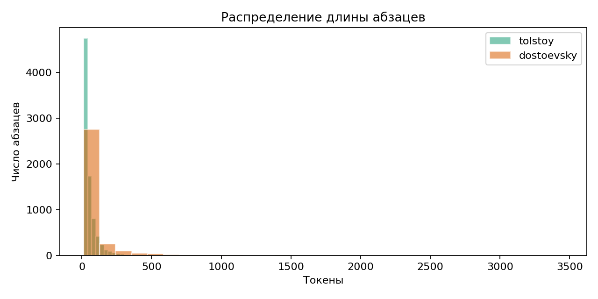
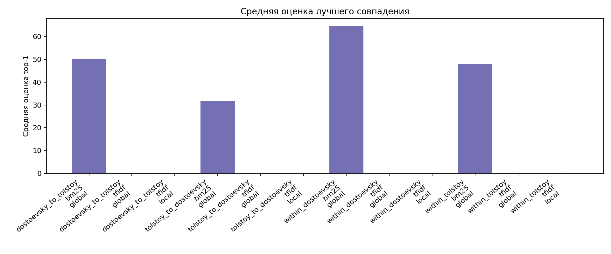
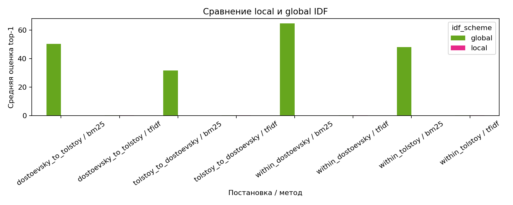
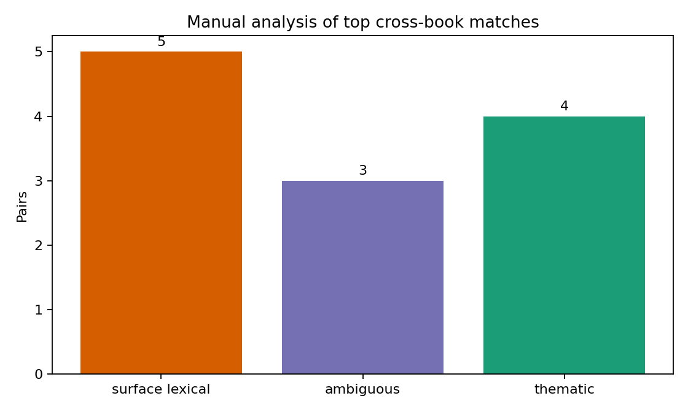

# Отчет по дополнительной задаче: Толстой и Достоевский

## 1. Постановка

Нужно:

- разбить два романа из прошлого ДЗ на абзацы;
- найти наиболее похожие абзацы внутри каждого романа;
- найти наиболее похожие абзацы между двумя романами;
- сравнить `tf-idf` и `BM25`;
- обосновать выбор `idf`-схемы для этой задачи.

## 2. Данные и подготовка корпуса

Подготовка корпуса:

1. HTML/SHTML-файлы декодированы из `cp1251`.
2. Выделены блоки `dd/h4`.
3. Убраны служебные фрагменты сайта, явные комментарии и редакторский мусор.
4. Каждый абзац получил устойчивый идентификатор.

Итоговая сводка:

| Автор | Роман | Абзацы | Среднее число токенов | Медиана числа токенов |
|:--|:--|--:|--:|--:|
| `tolstoy` | `War and Peace` | 8,313 | 53.39 | 36 |
| `dostoevsky` | `The Brothers Karamazov` | 3,256 | 87.36 | 35 |

У Достоевского абзацы в среднем заметно длиннее, чем у Толстого, а значит и лексическое перекрытие внутри романа у него должно быть стабильнее.

## 3. Методика поиска похожих абзацев

Использованы четыре поисковые постановки: `within_tolstoy`, `within_dostoevsky`, `tolstoy_to_dostoevsky`,  `dostoevsky_to_tolstoy`.

Модели: `tf-idf`, `BM25`.

Для вопроса об `idf` сравнивал:

- `tf-idf + global idf`
- `tf-idf + local idf`

`BM25` использовал в основной постановке с общим корпусом как более естественная модель для поиска по объединённому корпусу абзацев.

## 4. Результаты

Сводка по лучшему совпадению для каждого запроса:

| Постановка | Метод | IDF | Среднее top-1 | Медиана top-1 | P90 top-1 |
|:--|:--|:--|--:|--:|--:|
| Внутри Толстого | tf-idf | global | 0.2094 | 0.1932 | 0.2992 |
| Внутри Толстого | tf-idf | local | 0.2099 | 0.1935 | 0.3012 |
| Внутри Толстого | BM25 | global | 47.9899 | 36.9038 | 84.8026 |
| Внутри Достоевского | tf-idf | global | 0.2358 | 0.2208 | 0.3370 |
| Внутри Достоевского | tf-idf | local | 0.2304 | 0.2160 | 0.3330 |
| Внутри Достоевского | BM25 | global | 64.7192 | 37.7758 | 130.3298 |
| Толстой -> Достоевский | tf-idf | global | 0.1469 | 0.1381 | 0.2150 |
| Толстой -> Достоевский | tf-idf | local | 0.1872 | 0.1785 | 0.2570 |
| Толстой -> Достоевский | BM25 | global | 31.5679 | 24.4404 | 56.1325 |
| Достоевский -> Толстой | tf-idf | global | 0.1790 | 0.1692 | 0.2512 |
| Достоевский -> Толстой | tf-idf | local | 0.2160 | 0.2055 | 0.2981 |
| Достоевский -> Толстой | BM25 | global | 50.3146 | 29.1952 | 101.4532 |

{ width=82% }

Основные наблюдения:

- внутри романов сходство выше, чем между романами;
- у Достоевского внутри-романная близость выше, чем у Толстого;
- `BM25` дает более сильные лексические совпадения, чем `tf-idf`;
- между романами совпадения существуют, но в среднем они слабее совпадений внутри одного романа, что как будто бы и так интуитивно понятно :О)

## 5. Анализ `idf`

Сравнение `global` и `local idf` показывает две разные картины:

1. Для поиска внутри одного романа разница почти исчезает.
Для Толстого:
- `0.2094` против `0.2099`

Для Достоевского:
- `0.2358` против `0.2304`

То есть внутри одного романа выбор `idf`-схемы почти не меняет результат.

2. Для поиска между романами `local idf` у `tf-idf` заметно сильнее.
Например:

- `tolstoy_to_dostoevsky`: `0.1469 -> 0.1872`
- `dostoevsky_to_tolstoy`: `0.1790 -> 0.2160`

Интерпретация:

- `global idf` лучше отражает единую редкость слов на объединенном корпусе;
- `local idf` сильнее подчеркивает слова, редкие именно в целевом романе;
- поэтому для межроманного поиска он даёт более жёсткое различение по словам.

Мой практический вывод такой:

- если цель в единой постановке и сопоставимости внутри и между романами, я бы использовал `global idf`;
- если цель именно в поиске наилучших межроманных лексических совпадений, `local idf` у `tf-idf` выглядит сильнее.

Это хорошо видно на графике:

## 6. Ручной анализ лучших межроманных пар

Чтобы проверить, насколько лучшие межроманные пары действительно содержательны, а не только лексически похожи, я вручную разобрал 12 сильных пар из направлений `tolstoy_to_dostoevsky` и `dostoevsky_to_tolstoy`.

Артефакты:

- [manual_cross_book_analysis.csv](artifacts/authors_search/manual_cross_book_analysis.csv)
- [manual_cross_book_category_summary.csv](artifacts/authors_search/manual_cross_book_category_summary.csv)
- [manual_cross_book_assessment_summary.csv](artifacts/authors_search/manual_cross_book_assessment_summary.csv)

Сводка по категориям:

| Категория | Пар |
|:--|--:|
| Поверхностно-лексические | 5 |
| Неоднозначные | 3 |
| Тематические | 4 |

Сводка по силе совпадения:

| Оценка силы совпадения | Пар |
|:--|--:|
| Слабые | 5 |
| Средние | 5 |
| Сильные | 2 |

Что это показывает:

- самая частая категория это поверхностно-лексические совпадения: французские вставки, формульные обращения, риторические повторы, междометия и смеховые маркеры вроде `ха-ха`;
- еще часть совпадений неоднозначна: лексическое перекрытие заметно, и некоторая тематическая близость тоже есть, но она строится на слишком общей эмоциональной или риторической лексике;
- при этом есть и действительно тематические пары, где совпадают мотивы долга, религиозного объяснения страдания, внутреннего суда над собой и моральной обязанности.

Практический смысл, который можно вынести их этого разбора:

- `BM25` и `tf-idf` действительно находят небессмысленные межроманные параллели;
- но без ручной проверки их нельзя автоматически считать семантическими аналогами;
- лучшее лексическое совпадение между романами часто оказывается стилистическим или формульным, а не содержательно близким.

То есть чисто поисковая постановка здесь полезна скорее как инструмент отбора кандидатов для последующего литературного анализа, а не как готовый детектор истинных тематических параллелей.

## 7. Выводы

1. Наиболее сильные совпадения внутри одного романа часто возникают там, где есть длинные письма, монологи или повторно обсуждаемые сюжетные эпизоды.
2. Между романами лексическое сходство тоже есть, но ручной анализ показывает смешанную картину: часть совпадений поверхностна, часть действительно тематична.
3. Это значит, что чисто лексические методы хорошо ловят кандидатов на межтекстовые параллели, но не гарантируют смысловой эквивалентности.

Если улучшать решение дальше, самые разумные направления такие:

1. Расширить ручную разметку с 12 пар до нескольких десятков и посчитать долю действительно тематических совпадений отдельно для `BM25` и `tf-idf`.
2. Разделить повествовательный текст и редакторские / вставные блоки еще жестче.
3. Проверить сегментацию по предложениям, а не по абзацам, для более тонких совпадений.
