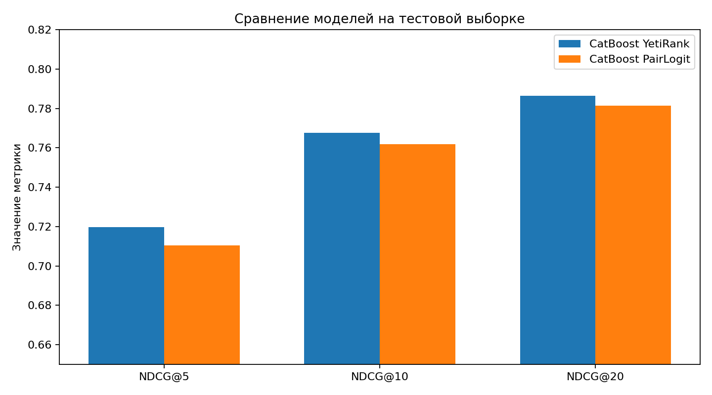
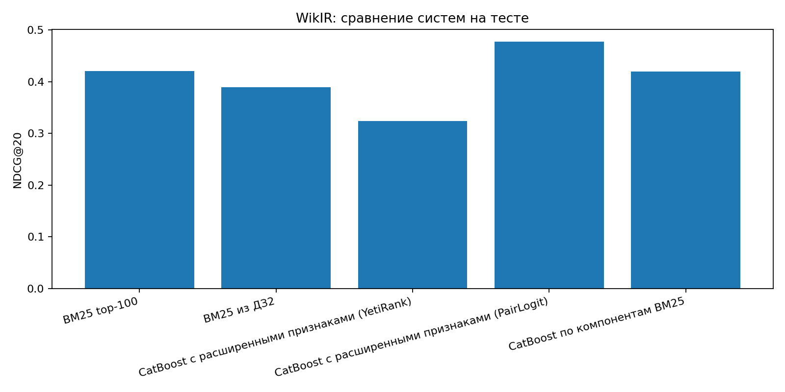
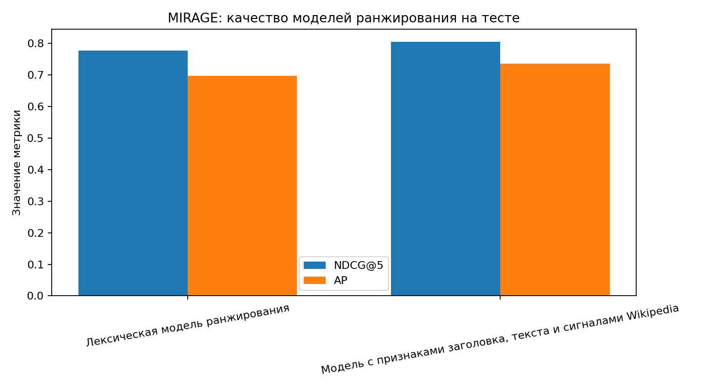

# DZ3: обучение ранжированию

## 1. MS LETOR

Для этого раздела использовал набор `msrank_10k`, который совместим с `LETOR` и позволяет воспроизвести стандартный пример применения `CatBoost` к задаче обучения ранжированию.
Из обучающей части была выделил отдельную валидационную подвыборку по группам запросов, после чего обучал модель `YetiRank`. Настройка модели идёт по валидации, а тест используется только для финальной проверки качества.

| Метрика | Валидация | Тест |
| --- | ---: | ---: |
| AP | 0.63146 | 0.56187 |
| NDCG@10 | 0.41637 | 0.39897 |
| NDCG@20 | 0.45579 | 0.43856 |

## 2. Internet Mathematics 2009

В `Internet Mathematics 2009` исходные строки уже содержали разреженные признаки и метку релевантности, но идентификатор запроса находился не в поле `qid`, а в комментарии после `#`. Поэтому первым шагом данные были приведены к LETOR-совместимому виду с явным `qid`, после чего была собрана статистика по числу запросов, размеру групп и плотности матрицы признаков.
Далее проверил два ранжирующих варианта на `CatBoost`: `YetiRank` и `PairLogit`. В обоих случаях целевой метрикой служила `NDCG`, а подбор числа итераций выполнялся по отдельной валидации.

Лучший метод: `catboost_yetirank`.

| Модель | NDCG@5 | NDCG@10 | NDCG@20 |
| --- | ---: | ---: | ---: |
| catboost_yetirank | 0.71979 | 0.76753 | 0.78650 |
| catboost_pairlogit | 0.71055 | 0.76182 | 0.78140 |

Обе модели дают близкое качество, однако `YetiRank` немного превосходит `PairLogit` по всем значениям `NDCG`, поэтому именно его было бы разумно считать базовым решением для этого набора.

## 3. WikIR

Здесь реализовал оба подпункта задания.
Для пункта `3.1` к исходному `BM25` добавил признаки, описывающие пару запрос-документ: длина запроса, число совпавших терминов, сумма и максимум частот, сумма и максимум `idf`, доля покрытия запроса, расстояние между совпавшими терминами и совпадения биграмм.
Обучающая выборка строилась из релевантных документов и такого же числа нерелевантных документов для каждого запроса, причём отрицательные примеры брались из верхней части выдачи `BM25`, чтобы задача оставалась содержательной.
Для пункта `3.2` отдельно построил модель, которая использует только компоненты, лежащие в основе `BM25`: частоты терминов, `idf` и длину документа.

Лучшая модель ранжирования: `CatBoost с расширенными признаками (PairLogit)` с `NDCG@20 = 0.47733`.

| Система | AP | NDCG@20 |
| --- | ---: | ---: |
| BM25 по верхним 100 документам | 0.31670 | 0.42016 |
| Лучший BM25 из ДЗ2 | 0.20204 | 0.38918 |
| CatBoost с расширенными признаками (YetiRank) | 0.25079 | 0.32417 |
| CatBoost с расширенными признаками (PairLogit) | 0.36526 | 0.47733 |
| CatBoost по компонентам BM25 | 0.33189 | 0.41927 |

Выводы здесь можно сделать такие. Во-первых, расширенный набор признаков в сочетании с `PairLogit` действительно улучшает базовый `BM25` и заметно превосходит как top-100 базу, так и лучший результат из `ДЗ2`.
Во-вторых, модель по компонентам `BM25` почти воспроизводит исходный `BM25`, но не даёт такого выигрыша, как более богатое описание пары запрос-документ.

## 4. MIRAGE

Для `MIRAGE` сначала построил стратифицированное разбиение по полю `source`, чтобы в обучении, валидации и тесте сохранялось происхождение вопросов из разных подколлекций.
Каждый кандидатный фрагмент рассматривался как двухпольный документ: отдельно вычислялись признаки по заголовку страницы и по основному тексту фрагмента. 
Дополнительно были собраны внешние признаки страницы из `Wikipedia`: суммарные просмотры за последние 12 месяцев, среднее число просмотров в месяц, число входящих ссылок и число перенаправлений.
Финальная улучшенная модель объединяет эти сигналы с лексическими признаками из пункта `3.1` и сравнивается с более простой лексической базой.

Лучшая модель ранжирования: `Модель с признаками заголовка, текста и сигналами Wikipedia` с `NDCG@5 = 0.80551`.

| Модель | AP | NDCG@3 | NDCG@5 |
| --- | ---: | ---: | ---: |
| Лексическая модель ранжирования | 0.69796 | 0.70419 | 0.77774 |
| Модель с признаками заголовка, текста и сигналами Wikipedia | 0.73564 | 0.74707 | 0.80551 |

Здесь улучшенная модель выигрывает у лексической базы по всем показателям. Это важно, потому что прирост достигается не только за счёт текстовых совпадений, но и за счёт структуры страницы и внешних сигналов популярности и связности.