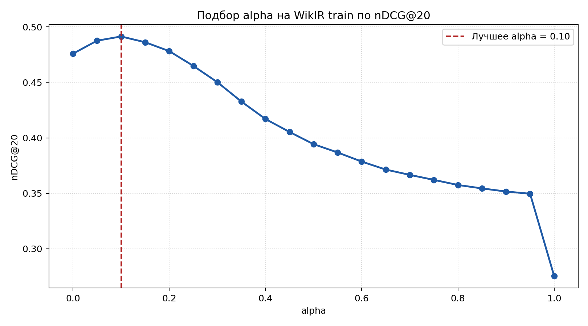
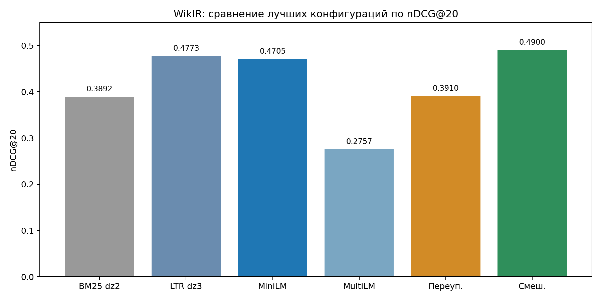
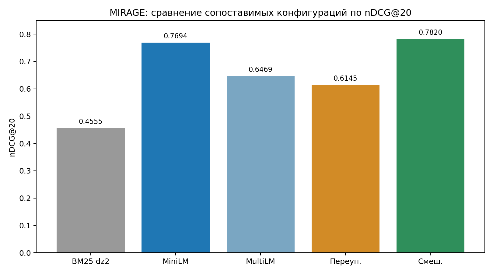

# DZ4: нейросетевой поиск и переупорядочивание

## Данные и постановка эксперимента

- Использованы оба корпуса из условия: `WikIR en1k` и `MIRAGE`.
- Для `WikIR` использованы готовые обучающая и тестовая части.
- Для `MIRAGE` тестовая часть воспроизведена тем же стратифицированным разбиением по полю `source`, что и в `dz3`.
- Во всех основных конфигурациях считаются метрики `P@1`, `P@10`, `P@20`, `MAP@20`, `nDCG@20`.

## Выбор моделей

- `all-MiniLM-L6-v2` выбрана как компактная и быстрая модель, удобная как сильная базовая точка для смыслового поиска.
- `paraphrase-multilingual-MiniLM-L12-v2` выбрана как более крупная многоязычная модель, чтобы проверить, даст ли более богатое смысловое представление выигрыш на тех же данных.
- Для переупорядочивания использована `all-MiniLM-L6-v2`. Это разумный компромисс между качеством и временем ответа, но такая схема слабее парной модели, которая оценивает запрос и документ совместно.

## Результаты нейросетевого поиска

| Набор | Модель | P@1 | P@10 | P@20 | MAP@20 | nDCG@20 | Среднее время запроса, с |
| --- | --- | ---: | ---: | ---: | ---: | ---: | ---: |
| WikIR, тест | all-MiniLM-L6-v2 | 0.6500 | 0.2430 | 0.1705 | 0.1929 | 0.4705 | 0.001630 |
| WikIR, тест | paraphrase-multilingual-MiniLM-L12-v2 | 0.4400 | 0.1300 | 0.0900 | 0.0952 | 0.2757 | 0.001902 |
| MIRAGE, тест | all-MiniLM-L6-v2 | 0.5922 | 0.1129 | 0.0582 | 0.7039 | 0.7694 | 0.000491 |
| MIRAGE, тест | paraphrase-multilingual-MiniLM-L12-v2 | 0.5109 | 0.0927 | 0.0491 | 0.5841 | 0.6469 | 0.000451 |

Вывод по пункту 1:

- На обоих наборах лучшей оказалась `all-MiniLM-L6-v2`.
- На `WikIR` разница особенно велика: по `nDCG@20` модель `all-MiniLM-L6-v2` даёт `0.4705`, тогда как `paraphrase-multilingual-MiniLM-L12-v2` даёт только `0.2757`.
- На `MIRAGE` картина такая же: `0.7694` против `0.6469` по `nDCG@20`.
- По времени ответа обе модели близки, поэтому здесь нет причины предпочесть более слабую модель.

## Результаты переупорядочивания

| Набор | Модель | k | P@1 | P@10 | P@20 | MAP@20 | nDCG@20 | Среднее время запроса, с |
| --- | --- | ---: | ---: | ---: | ---: | ---: | ---: | ---: |
| WikIR, тест | all-MiniLM-L6-v2 | 10 | 0.4800 | 0.1770 | 0.1295 | 0.1579 | 0.3413 | 0.002299 |
| WikIR, тест | all-MiniLM-L6-v2 | 20 | 0.5300 | 0.2050 | 0.1295 | 0.1686 | 0.3626 | 0.001258 |
| WikIR, тест | all-MiniLM-L6-v2 | 50 | 0.5300 | 0.2120 | 0.1365 | 0.1711 | 0.3721 | 0.003336 |
| WikIR, тест | all-MiniLM-L6-v2 | 100 | 0.5300 | 0.2250 | 0.1465 | 0.1807 | 0.3910 | 0.001426 |
| MIRAGE, тест | all-MiniLM-L6-v2 | 10 | 0.4686 | 0.0742 | 0.0391 | 0.5158 | 0.5524 | 0.000038 |
| MIRAGE, тест | all-MiniLM-L6-v2 | 20 | 0.4812 | 0.0781 | 0.0391 | 0.5316 | 0.5652 | 0.000020 |
| MIRAGE, тест | all-MiniLM-L6-v2 | 50 | 0.5030 | 0.0839 | 0.0423 | 0.5638 | 0.6011 | 0.000405 |
| MIRAGE, тест | all-MiniLM-L6-v2 | 100 | 0.5102 | 0.0859 | 0.0435 | 0.5755 | 0.6145 | 0.000607 |

Вывод по пункту 2:

- Лучший результат переупорядочивания по `nDCG@20` достигается при `k = 100` и для `WikIR`, и для `MIRAGE`.
- При увеличении `k` качество растёт, что логично: модель получает больше кандидатов для повторной сортировки.
- При этом даже лучший вариант переупорядочивания уступает чистому нейросетевому поиску.
- На `WikIR` разница между лучшим нейросетевым поиском и лучшим переупорядочиванием составляет `0.4705 - 0.3910 = 0.0795` по `nDCG@20`.
- На `MIRAGE` разница ещё заметнее: `0.7694 - 0.6145 = 0.1549` по `nDCG@20`.

 Текущее переупорядочивание не усиливает поиск, а ослабляет его. Причина правдоподобна: мы ограничены кандидатами от `BM25`, а само переупорядочивание использует ту же косинусную близость, но без более сильной парной модели.

## Результаты смешанной модели

- Коэффициент `alpha` подбирался на обучающей части `WikIR` по метрике `nDCG@20`.
- Перед смешиванием оценки `BM25` нормировались отдельно для каждого запроса по схеме min-max в диапазон `[0, 1]`.
- Лучшее значение: `alpha = 0.1`.

| Набор | Модель | alpha | P@1 | P@10 | P@20 | MAP@20 | nDCG@20 | Среднее время запроса, с |
| --- | --- | ---: | ---: | ---: | ---: | ---: | ---: | ---: |
| WikIR, тест | all-MiniLM-L6-v2 | 0.10 | 0.6800 | 0.2620 | 0.1795 | 0.2105 | 0.4900 | 0.000014 |
| MIRAGE, тест | all-MiniLM-L6-v2 | 0.10 | 0.6134 | 0.1141 | 0.0585 | 0.7194 | 0.7820 | 0.000012 |

Вывод по пункту 3:

- Смешанная модель оказалась лучшим вариантом среди уже проверенных конфигураций.
- На `WikIR` она улучшает `nDCG@20` относительно лучшего чистого нейросетевого поиска на `+0.0195`: `0.4705 -> 0.4900`.
- На `MIRAGE` улучшение тоже есть: `+0.0126`: `0.7694 -> 0.7820`.
- Оптимальное значение `alpha = 0.1` означает, что наилучший результат даёт схема, где смысловой сигнал доминирует, а вклад `BM25` остаётся вспомогательным.

### Подбор коэффициента `alpha`



По кривой видно, что максимум по `nDCG@20` достигается вблизи `alpha = 0.1`. При дальнейшем увеличении доли `BM25` качество постепенно снижается, а при `alpha = 1.0` результат фактически сводится к чисто лексическому ранжированию и становится существенно слабее.

## Эффективность

### Время кодирования

| Набор | Модель | Кодирование документов, с | Кодирование запросов, с |
| --- | --- | ---: | ---: |
| WikIR | all-MiniLM-L6-v2 | 6524.29 | 15.22 |
| WikIR | paraphrase-multilingual-MiniLM-L12-v2 | 1972.34 | 0.15 |
| MIRAGE | all-MiniLM-L6-v2 | 1795.15 | 2.68 |
| MIRAGE | paraphrase-multilingual-MiniLM-L12-v2 | 685.50 | 4.24 |

### Среднее время ответа на запрос

| Конфигурация | WikIR, с | MIRAGE, с | Комментарий |
| --- | ---: | ---: | --- |
| Лучший смысловой поиск (`all-MiniLM-L6-v2`) | 0.001630 | 0.000491 | быстрый отклик после подготовки индекса |
| Вторая модель (`paraphrase-multilingual-MiniLM-L12-v2`) | 0.001902 | 0.000451 | по скорости сопоставима, но слабее по качеству |
| Лучшее переупорядочивание (`k = 100`) | 0.001426 | 0.000607 | указано время только второй стадии, без получения кандидатов `BM25` |
| Смешанная модель (`alpha = 0.1`) | 0.000014 | 0.000012 | самая дешёвая стадия после получения исходных оценок |

Вывод по эффективности:

- После подготовки представлений документов все методы работают быстро.
- Время ответа у двух моделей близко, поэтому выбор в пользу `all-MiniLM-L6-v2` делается по качеству, а не по скорости.
- Для переупорядочивания в таблице указано время только самой стадии повторной сортировки. Стоимость получения кандидатов `BM25` в эти числа не входит.
- Переупорядочивание не даёт выигрыша по качеству, поэтому его дополнительная вычислительная сложность в текущей постановке не оправдывается.
- Смешанная модель почти ничего не стоит по времени и при этом даёт лучший итоговый результат.

## Сравнение с `dz2` и `dz3`

- На `WikIR` лучший `BM25` из `dz2` давал `nDCG@20 = 0.3892`. Уже чистый нейросетевой поиск поднял это значение до `0.4705`, а смешанная модель до `0.4900`.
- На `MIRAGE` лучший `BM25` из `dz2` давал `nDCG@20 = 0.4555`. Чистый нейросетевой поиск поднял это значение до `0.7694`, а смешанная модель до `0.7820`.
- Для `WikIR` есть прямое сравнение с лучшим результатом из `dz3`: там `nDCG@20 = 0.4773`, а здесь смешанная модель даёт `0.4900`, то есть улучшение на `+0.0127`.
- Для `MIRAGE` прямое численное сравнение с `dz3` ограничено, потому что в `dz3` сохранены другие метрики: `AP` и `nDCG@5`. Сопоставлять их с `MAP@20` и `nDCG@20` напрямую некорректно.

## Сводные таблицы

### Общая таблица лучших конфигураций

| Группа методов | Набор | Лучшая конфигурация | Основная метрика | Значение |
| --- | --- | --- | --- | ---: |
| `dz2` | WikIR | лучший `BM25` | `nDCG@20` | 0.3892 |
| `dz2` | MIRAGE | лучший `BM25` | `nDCG@20` | 0.4555 |
| `dz3` | WikIR | лучший обученный ранжировщик | `nDCG@20` | 0.4773 |
| `dz4` | WikIR | лучший смысловой поиск, `all-MiniLM-L6-v2` | `nDCG@20` | 0.4705 |
| `dz4` | MIRAGE | лучший смысловой поиск, `all-MiniLM-L6-v2` | `nDCG@20` | 0.7694 |
| `dz4` | WikIR | лучшее переупорядочивание, `k = 100` | `nDCG@20` | 0.3910 |
| `dz4` | MIRAGE | лучшее переупорядочивание, `k = 100` | `nDCG@20` | 0.6145 |
| `dz4` | WikIR | смешанная модель, `alpha = 0.1` | `nDCG@20` | 0.4900 |
| `dz4` | MIRAGE | смешанная модель, `alpha = 0.1` | `nDCG@20` | 0.7820 |

В этой таблице оставлены только строки, где основная метрика сопоставима напрямую.

### WikIR: сопоставление лучших конфигураций по `nDCG@20`

| Подход | Лучшая конфигурация | nDCG@20 | Комментарий |
| --- | --- | ---: | --- |
| `dz2` | лучший `BM25` | 0.3892 | сильная лексическая база |
| `dz3` | лучший обученный ранжировщик | 0.4773 | прямое сравнение возможно |
| `dz4` | `all-MiniLM-L6-v2` | 0.4705 | лучший чистый смысловой поиск |
| `dz4` | `paraphrase-multilingual-MiniLM-L12-v2` | 0.2757 | заметно слабее |
| `dz4` | лучшее переупорядочивание, `k = 100` | 0.3910 | хуже чистого смыслового поиска |
| `dz4` | смешанная модель, `alpha = 0.1` | 0.4900 | лучший итоговый результат |

### MIRAGE: сопоставимые результаты по `nDCG@20`

| Подход | Лучшая конфигурация | nDCG@20 | Комментарий |
| --- | --- | ---: | --- |
| `dz2` | лучший `BM25` | 0.4555 | базовый лексический поиск |
| `dz4` | `all-MiniLM-L6-v2` | 0.7694 | лучший чистый смысловой поиск |
| `dz4` | `paraphrase-multilingual-MiniLM-L12-v2` | 0.6469 | слабее `all-MiniLM-L6-v2` |
| `dz4` | лучшее переупорядочивание, `k = 100` | 0.6145 | хуже чистого смыслового поиска |
| `dz4` | смешанная модель, `alpha = 0.1` | 0.7820 | лучший сопоставимый результат |

### MIRAGE: справочно о лучшем результате из `dz3`

| Подход | Лучшая конфигурация | Метрики | Комментарий |
| --- | --- | --- | --- |
| `dz3` | лучший обученный ранжировщик | `AP = 0.7356`, `nDCG@5 = 0.8055` | полезно для ориентира, но не для прямого численного сравнения с `nDCG@20` |

## Графики

### WikIR: сравнение лучших конфигураций по `nDCG@20`



### MIRAGE: сравнение сопоставимых конфигураций по `nDCG@20`



Примечание: лучший результат из `dz3` для `MIRAGE` не включён в этот график, потому что там сохранены `AP` и `nDCG@5`, а не `nDCG@20`.

## Интерпретация результатов

- Самая цельная картина здесь такая: сочетание лексического сигнала `BM25` и смыслового сходства работает лучше, чем каждый из этих сигналов по отдельности.
- Лучшая из двух выбранных моделей для смыслового поиска: `all-MiniLM-L6-v2`.
- Сама по себе более крупная многоязычная модель `paraphrase-multilingual-MiniLM-L12-v2` в этом задании оказалась слабее на обоих наборах.
- Переупорядочивание в текущем виде оказалось самым слабым местом работы. Оно не улучшает, а ухудшает результат относительно лучшего нейросетевого поиска.
- Смешанная модель, напротив, выглядит логично и устойчиво: небольшой вклад `BM25` дополняет смысловой поиск и даёт лучший итог.

## Ограничения эксперимента

- Переупорядочивание построено на косинусной близости той же модели, а не на отдельной парной модели. Это ограничивает потенциал улучшения.
- Для `MIRAGE` из `dz3` сохранены другие метрики, поэтому прямое сравнение по `nDCG@20` недоступно.
- В отчёте не рассматривается дополнительное задание с дообучением парной модели, потому что базовая часть работы уже позволяет сделать содержательные выводы.

## Что можно улучшить

- Для этапа переупорядочивания стоит попробовать отдельную парную модель. Именно здесь сейчас главный резерв качества.
- Для более строгого сравнения с `dz3` на `MIRAGE` стоит пересчитать старые результаты в тех же метриках, что используются в `dz4`.
- Дополнительное задание с дообучением парной модели остаётся самым естественным направлением усиления работы.

## Воспроизводимость

- Основной сценарий реализован в [run_dz4_experiments.py](../scripts/run_dz4_experiments.py).
- Итоговые сводки лежат в [summary.json](summary.json), [summary.md](summary.md) и [report.md](report.md).
- Таблицы результатов лежат в каталоге `dz4/artifacts/tables`.
- Файлы ранжирования в формате TREC лежат в каталоге `dz4/artifacts/runs`.
- Кэш представлений лежит в каталоге `dz4/artifacts/cache`.
- Для полного повторения достаточно запустить:

```bash
python3 ../scripts/run_dz4_experiments.py
```

## Вывод

- Среди двух моделей лучшей оказалась `all-MiniLM-L6-v2`.
- Лучший итоговый результат даёт смешанная модель с `alpha = 0.1`.
- Чистый смысловой поиск уже сильнее классического `BM25`, а наилучший результат достигается при аккуратном объединении обоих сигналов.
