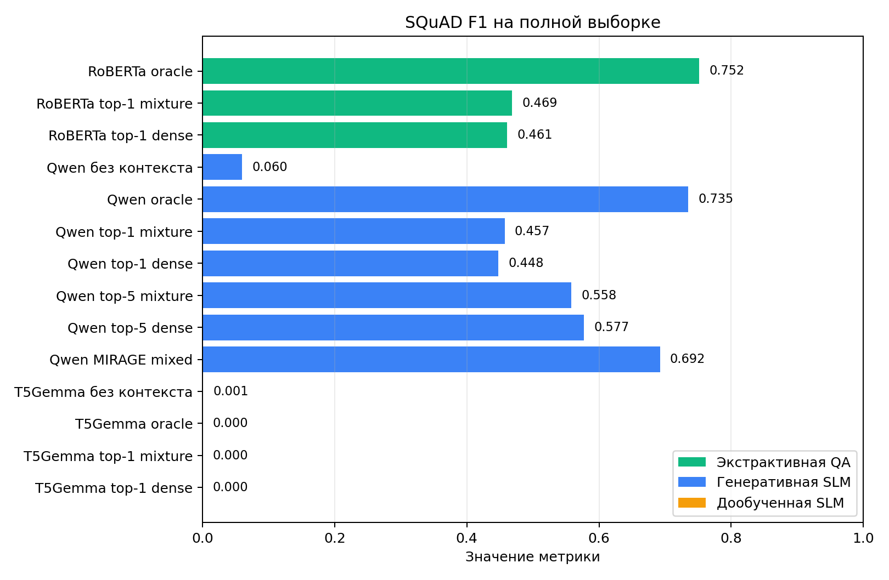
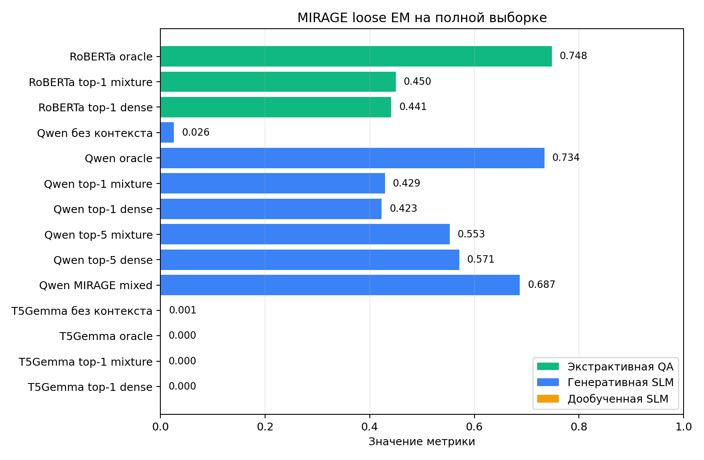
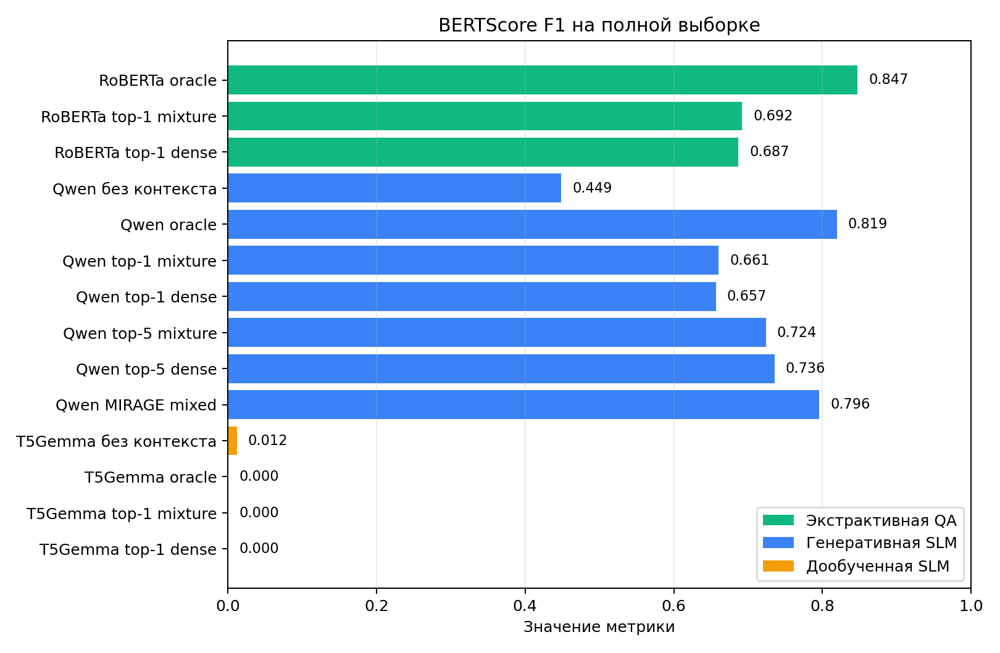
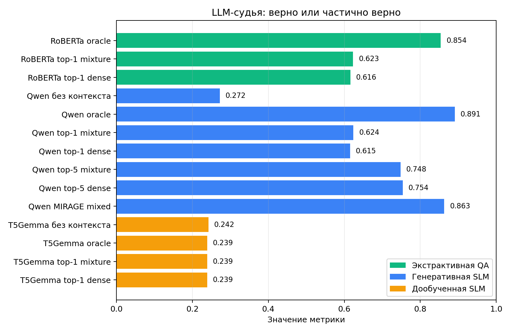
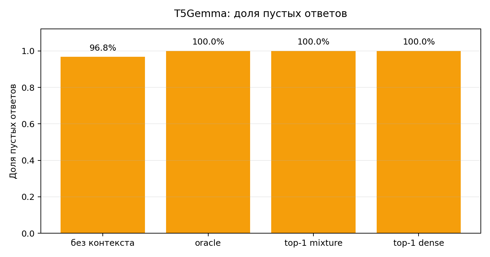

# HA5: ответы на вопросы на MIRAGE

## Краткий итог

Все пункты задания закрыты на одной фиксированной выборке из 1000 вопросов MIRAGE. Лучшее качество дает oracle-контекст: RoBERTa oracle достигает 0.632 SQuAD EM и 0.752 SQuAD F1, а Qwen oracle дает 0.735 SQuAD F1 и максимальную долю верных или частично верных ответов по LLM-судье - 0.891.

Среди режимов без oracle-контекста сильнее всего оказался Qwen с готовым смешанным контекстом MIRAGE: 0.692 SQuAD F1 и 0.687 MIRAGE loose. Top-5 контекст от ранжировщиков HA4 заметно лучше top-1, что показывает важность полноты поиска для итогового QA-качества.

Дообученная T5Gemma 270M в текущем LoRA-сценарии дала отрицательный результат: строковые метрики и BERTScore почти нулевые, LLM-судья считает только около 24% ответов частично полезными, а строго верных ответов почти нет. 

## 1. Постановка и данные

В работе сравниваются несколько режимов ответа на вопросы на наборе данных MIRAGE. Чтобы вычисления были воспроизводимыми и сопоставимыми с HA4, используется фиксированная случайная выборка из 1000 вопросов. Выборка построена из тестовой части MIRAGE, для которой уже были рассчитаны ранжировщики HA4; список `query_id` сохранен в отдельной папке `artifacts/data/mirage_sample_1000_qids.txt`.

Одна и та же выборка используется во всех экспериментах:

- генерация без контекста;
- генерация с oracle-контекстом;
- экстрактивная QA-модель с oracle-пассажем;
- top-1 контексты от двух ранжировщиков HA4;
- top-5 контексты от двух ранжировщиков HA4;
- смешанный контекст MIRAGE;
- дообученная T5Gemma в режимах без контекста, oracle, top-1 mixture и top-1 dense;
- оценка LLM-судьей для всех полных предсказаний.

Два ранжировщика из HA4:

- `ha4_mixture`: лучший mixture-прогон из HA4;
- `ha4_dense`: dense-прогон MiniLM как независимый сильный базовый вариант.

## 2. Модели и настройки

Генеративная SLM:

- `Qwen/Qwen2.5-1.5B-Instruct`;
- детерминированная генерация;
- `max_new_tokens=16`;
- ограничение контекста: 6000 символов.

Экстрактивная QA:

- `deepset/roberta-base-squad2`;
- `max_seq_len=384`;
- `doc_stride=128`.

Дообученная SLM:

- базовая модель `google/t5gemma-2-270m-270m`;
- LoRA-адаптация на SQuAD;
- 87599 обучающих примеров и 256 примеров для валидации;
- 1 эпоха, размер пакета 1, накопление градиента на 16 шагах;
- оценка на тех же 1000 вопросах MIRAGE в четырех режимах.

Оценка LLM-судьей:

- `Qwen/Qwen2.5-1.5B-Instruct`;
- инструкция с выбором одной из четырех меток:
  `correct`, `partially_correct`, `incorrect`, `unanswerable_or_bad_context`.
- всего 14000 оценок: 10 основных прогонов и 4 T5Gemma-прогона по 1000 ответов.

## 3. Метрики

Автоматические метрики:

- точное совпадение в стиле SQuAD;
- токеновый F1 в стиле SQuAD;
- строгое точное совпадение MIRAGE;
- мягкое точное совпадение MIRAGE;
- BERTScore F1 с моделью `bert-base-uncased`.

Метрики MIRAGE воспроизводят формулы из официального `LLM_Evaluator` репозитория `nlpai-lab/MIRAGE`: строки приводятся к нижнему регистру, `strict` требует полного совпадения ответа и предсказания, `loose` засчитывает ответ, если один из допустимых ответов входит в предсказание.

LLM-судья используется как дополнительная качественная оценка.

## 4. Таблица результатов

| Опыт | Вид | Контекст | N | SQuAD EM | SQuAD F1 | MIRAGE loose | BERTScore F1 | LLM: верно | LLM: верно/частично |
| --- | --- | --- | ---: | ---: | ---: | ---: | ---: | ---: | ---: |
| RoBERTa oracle | извлечение | oracle | 1000 | 0.632 | 0.752 | 0.748 | 0.847 | 0.479 | 0.854 |
| RoBERTa top-1 mixture | извлечение | top-1 mixture | 1000 | 0.376 | 0.469 | 0.450 | 0.692 | 0.299 | 0.623 |
| RoBERTa top-1 dense | извлечение | top-1 dense | 1000 | 0.372 | 0.461 | 0.441 | 0.687 | 0.302 | 0.616 |
| Qwen без контекста | генерация | без контекста | 1000 | 0.016 | 0.060 | 0.026 | 0.449 | 0.086 | 0.272 |
| Qwen oracle | генерация | oracle | 1000 | 0.578 | 0.735 | 0.734 | 0.819 | 0.522 | 0.891 |
| Qwen top-1 mixture | генерация | top-1 mixture | 1000 | 0.345 | 0.457 | 0.429 | 0.661 | 0.344 | 0.624 |
| Qwen top-1 dense | генерация | top-1 dense | 1000 | 0.333 | 0.448 | 0.423 | 0.657 | 0.343 | 0.615 |
| Qwen top-5 mixture | генерация | top-5 mixture | 1000 | 0.431 | 0.558 | 0.553 | 0.724 | 0.393 | 0.748 |
| Qwen top-5 dense | генерация | top-5 dense | 1000 | 0.447 | 0.577 | 0.571 | 0.736 | 0.409 | 0.754 |
| Qwen MIRAGE mixed | генерация | MIRAGE mixed | 1000 | 0.545 | 0.692 | 0.687 | 0.796 | 0.480 | 0.863 |
| T5Gemma без контекста | дообучение | без контекста | 1000 | 0.000 | 0.001 | 0.001 | 0.012 | 0.002 | 0.242 |
| T5Gemma oracle | дообучение | oracle | 1000 | 0.000 | 0.000 | 0.000 | 0.000 | 0.001 | 0.239 |
| T5Gemma top-1 mixture | дообучение | top-1 mixture | 1000 | 0.000 | 0.000 | 0.000 | 0.000 | 0.001 | 0.239 |
| T5Gemma top-1 dense | дообучение | top-1 dense | 1000 | 0.000 | 0.000 | 0.000 | 0.000 | 0.001 | 0.239 |

Полная CSV-таблица: `artifacts/tables/dz5_full_results_for_report.csv`.

\clearpage

## 5. Графики

\clearpage

## 6. Анализ

Без контекста модель отвечает плохо: Qwen получает только 0.060 SQuAD F1 и 0.026 MIRAGE loose. Это подтверждает, что MIRAGE в нашей выборке требует внешнего контекста, а не только параметрических знаний модели.

Oracle-контекст дает максимальный прирост качества. Qwen oracle поднимается до 0.735 SQuAD F1, а RoBERTa oracle дает лучшее точное совпадение: 0.632 SQuAD EM. Это ожидаемо: oracle-пассажи содержат ответ, а экстрактивная модель хорошо извлекает короткий фрагмент ответа.

Top-1 контекст от ранжировщиков заметно лучше режима без контекста, но сильно уступает oracle. Для Qwen top-1 mixture и top-1 dense дают 0.457 и 0.448 SQuAD F1. Для RoBERTa top-1 mixture и dense дают 0.469 и 0.461. Это показывает, что основной источник ошибки в top-1 режиме - промах поиска: если первый пассаж не содержит ответа, QA-модель не может восстановить правильный ответ.

Top-5 контекст улучшает генеративную QA относительно top-1. Qwen top-5 dense достигает 0.577 SQuAD F1, top-5 mixture - 0.558. Dense немного сильнее mixture в QA-режиме, хотя HA4 mixture был сильным ранжировщиком. Возможное объяснение: top-5 dense чаще дает полезный набор фактов для генерации, тогда как mixture лучше оптимизирован под метрики поиска, но не обязательно под итоговую QA-задачу.

Смешанный контекст MIRAGE остается сильнейшим генеративным режимом без oracle-контекста: 0.692 SQuAD F1 и 0.687 MIRAGE loose. Это логично, потому что смешанный контекст в MIRAGE является более курированным источником контекста, чем сырые top-k документы ранжировщика.

Дообученная T5Gemma в текущем LoRA-сценарии не дала полезного QA-качества на MIRAGE: все четыре режима имеют около нуля по SQuAD EM/F1 и MIRAGE loose. Причина видна и в самих предсказаниях: в режиме без контекста пустыми оказались 968 из 1000 ответов, а в oracle, top-1 mixture и top-1 dense - все 1000 из 1000. Поэтому это не пограничный случай строковых метрик, а фактический срыв генерации ответов в выбранном формате. Это важный отрицательный результат: одной эпохи SQuAD-дообучения с компактной T5Gemma 270M и текущим форматом генерации недостаточно, чтобы конкурировать с инструкционной моделью Qwen или экстрактивной RoBERTa.

Оценка LLM-судьей согласуется с общей картиной, но дает более мягкий результат. Например, Qwen oracle имеет 0.891 по доле верных или частично верных ответов против 0.734 MIRAGE loose. Для T5Gemma судья тоже мягче строковых метрик: около 0.239-0.242 ответов помечены как верные или частично верные, но доля строго верных ответов остается около 0.001-0.002. Это значит, что LLM-судья иногда засчитывает слабые или частично полезные формулировки, которые EM/F1 штрафуют. Поэтому такая оценка полезна как дополнительный анализ, но не заменяет EM/F1.

BERTScore также сохраняет общий порядок систем: максимум у RoBERTa oracle (0.847), затем Qwen oracle (0.819) и Qwen MIRAGE mixed (0.796). Для T5Gemma BERTScore близок к нулю: 0.012 в режиме без контекста и 0.000 в остальных трех режимах, что согласуется с большим числом пустых или нерелевантных ответов. Обычно абсолютные значения BERTScore выше строковых метрик, потому что он измеряет близость контекстных представлений, а не точное совпадение строк; здесь он дополнительно подтверждает провал текущего T5Gemma-сценария.

## 7. Покрытие пунктов задания

| Пункт | Комментарий |
| --- |  --- |
| SLM без контекста, 0-shot | Qwen2.5-1.5B-Instruct, 1000 вопросов |
| Экстрактивная QA / MRC | RoBERTa SQuAD2, oracle/top-1, 1000 вопросов |
| SLM с oracle-контекстом | Qwen + oracle-контекст |
| Top-1 контекст из ранжировщиков HA4 | mixture/dense для Qwen и RoBERTa |
| Top-5 контекст из ранжировщиков HA4 | mixture/dense для Qwen |
| Смешанный контекст | MIRAGE Qwen MIRAGE mixed |
| Оценка LLM-судьей | 14000 оценок, включая 4000 ответов T5Gemma |
| Дообучение T5Gemma | LoRA-дообучение на SQuAD и оценка 4 режимов на 1000 вопросах |
| BERTScore | посчитан для всех 14 полных прогонов с `bert-base-uncased` |

## 8. Ограничения и воспроизводимость

Дообучение `google/t5gemma-2-270m-270m` выполнено как LoRA-адаптация на SQuAD с последующей оценкой на 1000 вопросах MIRAGE в режимах без контекста, oracle, top-1 mixture и top-1 dense. Для T5Gemma использовалось отдельное локальное GPU-окружение, так как архитектура требует свежей dev-версии `transformers`. Метрики и BERTScore считались в основном окружении со стабильной версией `transformers` и пакетом `bert-score`. LLM-судья для T5Gemma также досчитан отдельно и включен в итоговую сводку.

Главное содержательное ограничение эксперимента - фиксированная выборка из 1000 вопросов. Она позволяет сделать все методы сравнимыми между собой при ограниченных вычислительных ресурсах, но не заменяет полный прогон по всему MIRAGE.

## 9. Артефакты

- Данные: `artifacts/data/mirage_eval_sample_1000.jsonl`
- Предсказания: `artifacts/predictions/*.jsonl`
- Метрики: `artifacts/metrics/*_metrics.json`
- Таблица результатов: `artifacts/tables/dz5_full_results_for_report.csv`
- Сводка покрытия: `artifacts/tables/dz5_task_coverage.md`
- Оценка LLM-судьей: `artifacts/judge/llm_judge_qwen2_5_1_5b_v2.jsonl`
